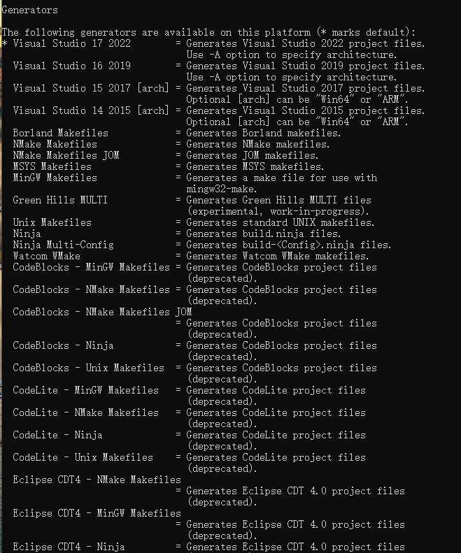
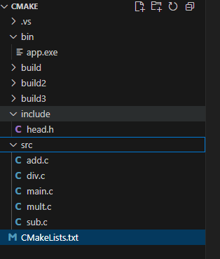

### 1.makefile

> 构建工具。

```makefile
目标文件 : 依赖文件
	命令
```

这里的编译和链接是在一起的,没有生成xxx.o文件

```makefile
a : a.cpp m_point.cpp
	g++ a.cpp m_point.cpp -o a
```

这里生成a.o 和m_points.o是先进行编译产生，再链接a 这个可执行文件

```makefile
a : a.o m_point.o
	g++ a.o m_point.o -o a

a.o : a.cpp 
	g++ -c a.cpp 

m_point.o : m_point.cpp
	g++ -c m_point.cpp
```


#### 1.伪目标

> ​	不生产文件的目标，用来执行一些操作，只是一个标签。

- clean

```makefile
.PHONE:clean //显示的告诉Make这个clean就是一个伪目标
```

```makefile
.PHONY : clean all
all : a c 
	@echo "a & c"  #这里的@符号是在终端上不显示
# a : a.o m_point.o
#	g++ a.o m_point.o -o a  //下面和这里是一样的

a c : a.o m_point.o
	g++ a.o m_point.o -o $@  #这里的$@符号是代表目标文件(double)

a.o : a.cpp 
	g++ -c a.cpp 

m_point.o : m_point.cpp
	g++ -c m_point.cpp

clean :
	DEL *.o a.exe


```

#### 2.如何添加注释

```makefile
#这里可以加注释
main : main.c # 这里可以加注释
	g++ main.c -o main  #这里不要加注释！！！！
```

#### 3.定义变量

```makefile
CFLAGS = -Wall -g -02 #这些是编译选项变量
targets = main #这是目标文件
sources = main.cpp message.cpp
objects = main.o message.o

main : main.cpp
	g++ $(CFLAGS) main.cpp -o $@

```

#### 4.自动变量

- `&@`表示目标文件
- `&<`表示第一个依赖文件
- `&^`表示所有依赖文件
- `%`表示通配符

#### 5.如果使用makefile时改名

`make -f xxx.mk` 用于修改makefile名字的

`make -n`用于调试

### 2.Cmake

```Cmake
cmake -G "MSYS Makefiles" -DCMAKE_C_COMPILER="C:\msys64\ucrt64\bin\gcc.exe" -DCMAKE_CXX_COMPILER="C:\msys64\ucrt64\bin\g++.exe" ..
```

### 3.2025_5_6学习

#### 3.1.->和.的区别

A->a   其中A为指针

A.a  A为结构体或者对象

### 4.GUN工具链

**GNU工具链中包含的项目有：**

GNU make：用于编译和构建的自动工具。
GNU编译器集合（GCC）：一组多种编程语言的编译器。
GNU Binutils：包含链接器ld、汇编器as和其它工具的工具集。
GNU Debugger（GDB）：代码调试工具。
GNU构建系统（autotools）：Autoconf、Autoheader、Automake、Libtool。

### 5.define能宏定义代码段(断言)

such ：

```C
#define Xil_AssertNonvoid(Expression)             \
{                                                  \
    if (Expression) {                              \
        Xil_AssertStatus = XIL_ASSERT_NONE;       \
    } else {                                       \
        Xil_Assert(__FILE__, __LINE__);            \
        Xil_AssertStatus = XIL_ASSERT_OCCURRED;   \
        return 0;                                  \
    }                                              \
}
```

1. **调试和错误检查**：
    这段宏是在调试过程中为了检查一个表达式是否成立，通常用于嵌入式系统中的错误检查、状态验证等。断言失败时，它会打印出位置并中止执行。
2. **断言失败时返回 `0`**：
    在函数返回值是 `0` 时，宏强制退出当前函数，表示出现了错误。对于嵌入式系统的调试来说，通常会在失败时立即终止某些操作，防止系统继续执行可能出错的代码。

**断言**（assertion）是一种用于程序调试的技术。它的作用是验证程序中某个条件是否成立。如果条件成立，则程序继续执行；如果条件不成立，则会触发错误，通常会打印调试信息并中止程序运行。

`\` 是一个 **行连接符**，也叫做 **续行符**（line continuation character）。它的作用是将一行代码延续到下一行，避免代码过长导致不易阅读或者无法写在一行内。\#define只能在一行操作。

ai生成的可移植的断言代码

```C
#include <stdio.h>
#include <stdlib.h>  // 用于exit()，或者在嵌入式平台中使用其他停止方法

// 定义一个用于调试的宏
#define ASSERT_ENABLED 0  // 1：开启断言 ;0：表示禁用断言

// 自定义的断言函数
#if ASSERT_ENABLED
    #define MY_ASSERT(expression) ((expression) ? (void)0 : my_assert(#expression, __FILE__, __LINE__))
#else
    #define MY_ASSERT(expression) (void)0  // 如果禁用了断言，什么都不做
#endif

// 断言失败的处理函数
void my_assert(const char *expr, const char *file, int line) {
    // 打印错误信息，调试时提供更多信息
    fprintf(stderr, "Assertion failed: %s, file %s, line %d\n", expr, file, line);

    // 终止程序，根据不同的环境可以选择不同的终止方法
    #ifdef _WIN32
        // Windows平台
        abort();  // 使用abort()终止程序
    #elif defined(__linux__) || defined(__unix__)
        // Linux/Unix平台
        abort();  // 也可以使用exit(1)来结束程序
    #else
        // 在嵌入式环境下，可能需要更复杂的终止处理
        // 比如在某些嵌入式系统上，可能直接关掉LED或打印错误信息
        while (1) { /* 永久挂起或进入调试模式 */ }
    #endif
}

int main() {
    int a = 5;
    MY_ASSERT(a == 6);  // 这条断言会被禁用，因为ASSERT_ENABLED为0

    return 0;
}
```

### 6.状态机编程

> 状态机是一种**有限状态自动机（Finite State Machine, FSM）**，描述了一个系统在任意时刻所处的状态，以及在某些输入/条件下，如何从一个状态转换到另一个状态。

#### 6.1密码锁状态机

- 用户要按下正确顺序的键（如 1→2→8→9）才能开锁
- 状态：
  - `WAIT_FOR_1`
  - `WAIT_FOR_2`
  - `WAIT_FOR_3`
  - `WAIT_FOR_4`
  - `UNLOCKED`
- 错误按键会重置状态
- 要求：设计状态转移图，状态函数尽量分离

```c
#include <stdio.h>
#include <Windows.h>
typedef enum {
    wait_num_1 = 1,
    wait_num_2,
    wait_num_8,
    wait_num_9,
    ulock,
} state;

state current_state = wait_num_1;

void wait_num_handle(state state, char num_true);
void state_machine()
{
    switch (current_state) {
        case wait_num_1:    wait_num_handle(wait_num_1, '1'); break;
        case wait_num_2:    wait_num_handle(wait_num_2, '2'); break;
        case wait_num_8:    wait_num_handle(wait_num_8, '8'); break;
        case wait_num_9:    wait_num_handle(wait_num_9, '9'); break;
        case ulock:         printf("Unlock success\n"); while (1); break;
    }
}

// 处理每个状态，等待用户输入数字
void wait_num_handle(state state, char num_true)
{
    char num;
    printf("请输入第 %d 位数字：", state);
    scanf(" %c", &num);  // 确保跳过空格和换行符

    if (num == num_true) {
        printf("输入正确，进入下一个状态。\n");
        current_state = (state + 1);  // 进入下一个状态
    } else {
        printf("输入错误，重新开始\n");
        current_state = wait_num_1;  // 错误时返回到初始状态
    }
}

int main()
{
    SetConsoleOutputCP(CP_UTF8);
    printf("密码验证开始！\n");
    while (1) {
        state_machine();
    }
    return 0;
}

```

```c
typedef enum {
  num_1=1,
  num_2,
  num_3,
  num_4,
}state;  //state中，num_1的初始值是1，如果不给初始值，则是0开始。
```

#### 6.2函数指针+枚举实现状态机

**模式设计：**

1. **定义状态（State）**：每个状态代表系统的不同阶段。
2. **定义策略（Strategy）**：为每个状态定义一个处理函数（即不同的策略）。
3. **使用函数指针**：根据当前状态，选择相应的策略函数。

```C
#include <stdio.h>

typedef enum{
    STATE_IDEA,
    STATE_EDIT,
    STATE_SAVE,
    STATE_EXIT,
}State;

State current_state = STATE_IDEA;

typedef void(*StateHandler)(void);

void STATE_IDEA_Handler();
void STATE_EDIT_Handler();
void STATE_SAVE_Handler();
void STATE_EXIT_Handler();

StateHandler HanlerTable[]=
{
    STATE_IDEA_Handler,
    STATE_EDIT_Handler,
    STATE_SAVE_Handler,
    STATE_EXIT_Handler
};

void STATE_IDEA_Handler()
{
    printf("idea\n");
    current_state = STATE_EDIT;
}

void STATE_EDIT_Handler()
{
    printf("EDIT\n");
    current_state = STATE_SAVE;
}
void STATE_SAVE_Handler()
{
    printf("SAVE\n");
    current_state = STATE_EXIT;
}
void STATE_EXIT_Handler()
{
    printf("EXIT\n");
    current_state = STATE_EDIT;
}

int main ()
{
    while(1)
    {
        HanlerTable[current_state]();
    }
    while(1);
    return 0;
}
```

### 7.MSB和LSB

> **MSB**（Most Significant Bit）和**LSB**（Least Significant Bit）是计算机中常见的术语，通常用来描述数据在二进制表示中的不同位置。

#### 7.1MSB

​	在二进制数表示中，MSB是位于最左边的位，它在数值中的“权重”最大。

对于 8 位的二进制数 `10011010`，MSB 是第一个 `1`，即 `1`，它表示该数字的“符号”或者其大致的“大小”。

#### 7.2LSB

​	在二进制数表示中，LSB是位于最右边的位，它在数值中的“权重”最小

对于 8 位的二进制数 `10011010`，LSB 是最后的 `0`，它代表数字最小单位的变化。

### 8._asm关键字

```c
#define portYIELD() __asm volatile ( "SWI 0" ::: "memory" );
```

#### 8.1 `_asm`

`__asm` 是 GNU 编译器（GCC）用于嵌入汇编代码的关键字，也可以写作 `asm`。这使得 C 语言程序能够直接嵌入汇编代码并将其与 C 语言代码结合使用。它提供了一种与处理器架构直接交互的方式。

- `__asm`：告诉编译器后面的代码是汇编语言代码，而不是 C 语言代码。

#### 8.2`SWI 0` 汇编指令

`SWI` 是 "Software Interrupt"（软件中断）的缩写。`SWI 0` 表示触发一个软件中断，通常用于系统调用或上下文切换。在这个例子中，`SWI 0` 是通过软件发起一个中断请求，通常该中断由操作系统的内核处理（在此是用于触发任务切换）。

- `SWI 0`：触发一个软件中断，操作系统会捕捉到这个中断并执行对应的处理逻辑。在 ARM 架构中，`SWI` 指令用于触发软件中断，在 FreeRTOS 中通常与任务调度相关。

#### 8.3`:::"memory"`

这是汇编指令的输出和输入约束部分（也称为 "clobber"）。它告诉编译器，这段汇编代码会影响内存状态。

- `:::`：表示没有输入和输出的寄存器，只是对内存进行影响。
- `"memory"`：告诉编译器，该汇编语句可能会修改内存中的内容，因此它不能假设在这条指令之前和之后的内存内容不变。它确保编译器不会优化掉这个指令的执行。

### 9.函数指针&回调函数

#### 9.1 **什么是函数指针？**

函数指针是指向函数的指针变量。与普通指针不同，函数指针存储的是函数的地址，而不是数据的地址。通过函数指针，我们可以动态地选择并调用不同的函数。

#### 9.2**如何声明函数指针？**

函数指针的声明格式如下：

```c
return_type (*pointer_name)(parameter_types);
```

- `return_type`：函数返回值类型
- `pointer_name`：函数指针的变量名
- `parameter_types`：函数的参数类型列表

示例：

```c
#include <stdio.h>

int add(int a, int b) {
    return a + b;
}

int subtract(int a, int b) {
    return a - b;
}

int main() {
    // 声明一个函数指针
    int (*func_ptr)(int, int);

    // 将函数指针指向 add 函数
    func_ptr = add;
    printf("Add: %d\n", func_ptr(3, 4));  // 调用 add 函数，输出 7

    // 将函数指针指向 subtract 函数
    func_ptr = subtract;
    printf("Subtract: %d\n", func_ptr(10, 4));  // 调用 subtract 函数，输出 6

    return 0;
}
```

#### 9.3**回调函数**

> 回调函数是一种通过函数指针实现的机制，其中一个函数通过函数指针调用另一个函数。
>
> 回调函数的关键在于**函数指针的传递**，我们把回调函数的地址作为参数传递给另一个函数，然后在另一个函数中调用回调函数。

#### 9.4 **如何使用回调函数？**

回调函数的步骤是：

1. 定义一个回调函数的类型。
2. 将回调函数作为参数传递给另一个函数。
3. 在另一个函数中使用回调函数。

示例：

假设我们有一个数组，想要通过回调函数实现对数组元素的处理（如加法、乘法等）。

```c
#include <stdio.h>

// 定义回调函数类型，返回值类型为 int，参数为 int
typedef int (*operation_t)(int);

// 实现回调函数：加法
int add_one(int a) {
    return a + 1;
}

// 实现回调函数：乘法
int multiply_by_two(int a) {
    return a * 2;
}

// 处理数组的函数，接受一个回调函数作为参数
void process_array(int* array, int size, operation_t operation) {
    for (int i = 0; i < size; i++) {
        array[i] = operation(array[i]);  // 调用回调函数处理每个元素
    }
}

int main() {
    int arr[] = {1, 2, 3, 4, 5};
    int size = sizeof(arr) / sizeof(arr[0]);

    // 处理数组，使用 add_one 作为回调函数
    process_array(arr, size, add_one);
    printf("Array after add_one: ");
    for (int i = 0; i < size; i++) {
        printf("%d ", arr[i]);
    }
    printf("\n");

    // 重新初始化数组
    int arr2[] = {1, 2, 3, 4, 5};

    // 处理数组，使用 multiply_by_two 作为回调函数
    process_array(arr2, size, multiply_by_two);
    printf("Array after multiply_by_two: ");
    for (int i = 0; i < size; i++) {
        printf("%d ", arr2[i]);
    }
    printf("\n");

    return 0;
}

```

### 10.io多路复用实现socket()

```c
ws2_32.lib   x86 

#include <stdio.h>
#include <stdlib.h>
#include <string.h>
#include <winsock2.h>

#define BUF_SIZE 1024
void ErrorHandling(char* message);

int main(int argc, char* argv[])
{
	WSADATA wsaData;
	SOCKET hServSock, hClntSock;
	SOCKADDR_IN servAdr, clntAdr;
	TIMEVAL timeout;
	fd_set reads, cpyReads;

	int adrSz;
	int strLen, fdNum, i;
	char buf[BUF_SIZE];

	//if (argc != 2) {
	//	printf("Usage : %s <port>\n", argv[0]);
	//	exit(1);
	//}
	if (WSAStartup(MAKEWORD(2, 2), &wsaData) != 0)
		ErrorHandling("WSAStartup() error!");

	hServSock = socket(PF_INET, SOCK_STREAM, 0);
	memset(&servAdr, 0, sizeof(servAdr));
	servAdr.sin_family = AF_INET;
	servAdr.sin_addr.s_addr = htonl(INADDR_ANY);
	servAdr.sin_port = htons(8888);

	if (bind(hServSock, (SOCKADDR*)&servAdr, sizeof(servAdr)) == SOCKET_ERROR)
		ErrorHandling("bind() error");
	if (listen(hServSock, 5) == SOCKET_ERROR)
		ErrorHandling("listen() error");

	FD_ZERO(&reads);
	FD_SET(hServSock, &reads);

	while (1)
	{
		cpyReads = reads;
		timeout.tv_sec = 5;
		timeout.tv_usec = 5000;

		if ((fdNum = select(0, &cpyReads, 0, 0, &timeout)) == SOCKET_ERROR)
			break;

		if (fdNum == 0)
			continue;

		for (i = 0; i < reads.fd_count; i++)
		{
			if (FD_ISSET(reads.fd_array[i], &cpyReads))
			{
				if (reads.fd_array[i] == hServSock)     // connection request!
				{
					adrSz = sizeof(clntAdr);
					hClntSock =
						accept(hServSock, (SOCKADDR*)&clntAdr, &adrSz);
					FD_SET(hClntSock, &reads);
					printf("connected client: %d \n", hClntSock);
				}
				else    // read message!
				{
					strLen = recv(reads.fd_array[i], buf, BUF_SIZE - 1, 0);
					if (strLen == 0)    // close request!
					{
						FD_CLR(reads.fd_array[i], &reads);
						closesocket(cpyReads.fd_array[i]);
						printf("closed client: %d \n", cpyReads.fd_array[i]);
					}
					else
					{
						send(reads.fd_array[i], buf, strLen, 0);    // echo!
					}
				}
			}
		}
	}
	closesocket(hServSock);
	WSACleanup();
	return 0;
}

void ErrorHandling(char* message)
{
	fputs(message, stderr);
	fputc('\n', stderr);
	exit(1);
}
```

```c
#include <winsock2.h>
#include <ws2tcpip.h>
#include <stdio.h>

#pragma comment(lib, "ws2_32.lib")

#define PORT 8888
#define MAX_CLIENTS 64
#define BUFFER_SIZE 1024

void HandleClient(SOCKET clientSocket, fd_set* readfds);

int main() {
    WSADATA wsaData;
    SOCKET listenSocket, clientSocket;
    struct sockaddr_in addr, clientAddr;
    int addrLen, maxSocket;
    fd_set readfds;
    char buffer[BUFFER_SIZE];

    // 初始化 Winsock
    if (WSAStartup(MAKEWORD(2, 2), &wsaData) != 0) {
        printf("WSAStartup failed\n");
        return 1;
    }

    // 创建监听 socket
    listenSocket = socket(AF_INET, SOCK_STREAM, 0);
    if (listenSocket == INVALID_SOCKET) {
        printf("Socket creation failed\n");
        WSACleanup();
        return 1;
    }

    // 设置监听地址
    addr.sin_family = AF_INET;
    addr.sin_port = htons(PORT);
    addr.sin_addr.s_addr = htonl(INADDR_ANY);

    // 绑定套接字
    if (bind(listenSocket, (SOCKADDR*)&addr, sizeof(addr)) == SOCKET_ERROR) {
        printf("Bind failed\n");
        closesocket(listenSocket);
        WSACleanup();
        return 1;
    }

    // 开始监听
    if (listen(listenSocket, SOMAXCONN) == SOCKET_ERROR) {
        printf("Listen failed\n");
        closesocket(listenSocket);
        WSACleanup();
        return 1;
    }

    FD_ZERO(&readfds);        // 清空文件描述符集
    FD_SET(listenSocket, &readfds); // 设置监听 socket
    maxSocket = listenSocket;  // 初始最大 socket 值为监听 socket

    printf("Waiting for client connections...\n");

    while (1) {
        fd_set copyfds = readfds;

        // 等待活动的 socket
        int result = select(maxSocket + 1, &copyfds, NULL, NULL, NULL);

        if (result == SOCKET_ERROR) {
            printf("select failed: %d\n", WSAGetLastError());
            break;
        }

        // 如果监听套接字准备好，表示有新连接
        if (FD_ISSET(listenSocket, &copyfds)) {
            addrLen = sizeof(clientAddr);
            clientSocket = accept(listenSocket, (SOCKADDR*)&clientAddr, &addrLen);
            if (clientSocket == INVALID_SOCKET) {
                printf("Accept failed\n");
                break;
            }

            // 获取客户端 IP 地址
            char ipStr[INET_ADDRSTRLEN];
            // 使用 inet_ntop 获取客户端 IP 地址
            InetNtop(AF_INET, &clientAddr.sin_addr, ipStr, sizeof(ipStr));
            printf("New client connected: %s:%d\n", ipStr, ntohs(clientAddr.sin_port));

            // 添加客户端 socket 到文件描述符集
            FD_SET(clientSocket, &readfds);

            // 更新最大 socket 值
            if (clientSocket > maxSocket) {
                maxSocket = clientSocket;
            }
        }

        // 处理所有已连接的客户端套接字
        for (int i = 0; i <= maxSocket; i++) {
            if (FD_ISSET(i, &copyfds) && i != listenSocket) { // 排除监听套接字
                HandleClient(i, &readfds);
            }
        }
    }

    // 关闭监听 socket
    closesocket(listenSocket);
    WSACleanup();
    return 0;
}

// 处理客户端数据
void HandleClient(SOCKET clientSocket, fd_set* readfds) {
    char buffer[BUFFER_SIZE];
    int len = recv(clientSocket, buffer, sizeof(buffer) - 1, 0);
    if (len <= 0) { // 客户端断开连接
        printf("Client disconnected\n");
        closesocket(clientSocket);
        FD_CLR(clientSocket, readfds);  // 从文件描述符集移除
    }
    else {
        buffer[len] = '\0'; // 添加字符串结束符
        printf("Received from client: %s\n", buffer);
        send(clientSocket, buffer, len, 0);  // 回显数据
    }
}


```

**最终版本**

```c
#include <winsock2.h>
#include <ws2tcpip.h>
#include <stdio.h>
#include <string.h>

#pragma comment(lib, "ws2_32.lib")

#define PORT 8888
#define MAX_CLIENTS 64
#define BUFFER_SIZE 2048

#pragma pack(push, 1)
typedef struct {
    int Messagelength; // 总包长，含头部
    char Address;
    char a;
} MessageHeader_t;

typedef struct {
    MessageHeader_t MessageHeader;
    char neirong;
} recv_t;
#pragma pack(pop)

// 为每个客户端保存上下文信息
typedef struct {
    SOCKET sock;
    char buffer[BUFFER_SIZE];
    size_t total_received;
    int in_use; // 1=占用，0=空
} ClientContext;

ClientContext clients[MAX_CLIENTS];

// 查找或分配一个可用的 ClientContext
ClientContext* find_client(SOCKET sock) {
    for (int i = 0; i < MAX_CLIENTS; i++) {
        if (clients[i].in_use && clients[i].sock == sock)
            return &clients[i];
    }
    return NULL;
}

ClientContext* alloc_client(SOCKET sock) {
    for (int i = 0; i < MAX_CLIENTS; i++) {
        if (!clients[i].in_use) {
            clients[i].in_use = 1;
            clients[i].sock = sock;
            clients[i].total_received = 0;
            memset(clients[i].buffer, 0, BUFFER_SIZE);
            return &clients[i];
        }
    }
    return NULL;
}

void free_client(SOCKET sock) {
    for (int i = 0; i < MAX_CLIENTS; i++) {
        if (clients[i].in_use && clients[i].sock == sock) {
            clients[i].in_use = 0;
            clients[i].sock = INVALID_SOCKET;
            clients[i].total_received = 0;
            memset(clients[i].buffer, 0, BUFFER_SIZE);
            return;
        }
    }
}

// 处理客户端数据，自动拆包
void HandleClient(ClientContext* ctx, fd_set* readfds) {
    int n = recv(ctx->sock, ctx->buffer + ctx->total_received, BUFFER_SIZE - ctx->total_received, 0);
    if (n <= 0) {
        printf("Client disconnected. Socket=%d\n", (int)ctx->sock);
        closesocket(ctx->sock);
        FD_CLR(ctx->sock, readfds);
        free_client(ctx->sock);
        return;
    }
    ctx->total_received += n;

    // 处理粘包/半包
    while (ctx->total_received >= sizeof(MessageHeader_t)) {
        MessageHeader_t* header = (MessageHeader_t*)ctx->buffer;
        int packet_length = header->Messagelength;
        if (packet_length <= 0 || packet_length > BUFFER_SIZE) {
            printf("Invalid packet length: %d\n", packet_length);
            closesocket(ctx->sock);
            FD_CLR(ctx->sock, readfds);
            free_client(ctx->sock);
            return;
        }
        if (ctx->total_received >= packet_length) {
            recv_t* packet = (recv_t*)ctx->buffer;
            printf("[SOCK %d] 收到包: Length=%d, Addr=0x%x, a=0x%x, 内容=%c\n",
                (int)ctx->sock, packet->MessageHeader.Messagelength,
                packet->MessageHeader.Address, packet->MessageHeader.a, packet->neirong);

            // 回显包数据到客户端（示例）
            send(ctx->sock, ctx->buffer, packet_length, 0);

            // 移除已处理包
            size_t remaining = ctx->total_received - packet_length;
            memmove(ctx->buffer, ctx->buffer + packet_length, remaining);
            ctx->total_received = remaining;
        }
        else {
            break; // 还没收到完整包
        }
    }
}

int main() {
    WSADATA wsaData;
    SOCKET listenSocket, clientSocket;
    struct sockaddr_in addr, clientAddr;
    int addrLen;
    fd_set readfds;
    char ipStr[INET_ADDRSTRLEN];

    memset(clients, 0, sizeof(clients));
    for (int i = 0; i < MAX_CLIENTS; i++) clients[i].sock = INVALID_SOCKET;

    if (WSAStartup(MAKEWORD(2, 2), &wsaData) != 0) {
        printf("WSAStartup failed\n");
        return 1;
    }
    listenSocket = socket(AF_INET, SOCK_STREAM, 0);
    if (listenSocket == INVALID_SOCKET) {
        printf("Socket creation failed\n");
        WSACleanup();
        return 1;
    }

    addr.sin_family = AF_INET;
    addr.sin_port = htons(PORT);
    addr.sin_addr.s_addr = htonl(INADDR_ANY);

    if (bind(listenSocket, (SOCKADDR*)&addr, sizeof(addr)) == SOCKET_ERROR) {
        printf("Bind failed\n");
        closesocket(listenSocket);
        WSACleanup();
        return 1;
    }
    if (listen(listenSocket, SOMAXCONN) == SOCKET_ERROR) {
        printf("Listen failed\n");
        closesocket(listenSocket);
        WSACleanup();
        return 1;
    }

    FD_ZERO(&readfds);
    FD_SET(listenSocket, &readfds);

    printf("Waiting for client connections on port %d...\n", PORT);

    while (1) {
        fd_set copyfds = readfds;
        int maxfd = listenSocket;
        for (int i = 0; i < MAX_CLIENTS; i++) {
            if (clients[i].in_use && clients[i].sock != INVALID_SOCKET) {
                FD_SET(clients[i].sock, &copyfds);
                if (clients[i].sock > maxfd)
                    maxfd = clients[i].sock;
            }
        }

        int result = select(maxfd + 1, &copyfds, NULL, NULL, NULL);
        if (result == SOCKET_ERROR) {
            printf("select failed: %d\n", WSAGetLastError());
            break;
        }

        // 新连接
        if (FD_ISSET(listenSocket, &copyfds)) {
            addrLen = sizeof(clientAddr);
            clientSocket = accept(listenSocket, (SOCKADDR*)&clientAddr, &addrLen);
            if (clientSocket != INVALID_SOCKET) {
                InetNtop(AF_INET, &clientAddr.sin_addr, ipStr, sizeof(ipStr));
                printf("New client connected: %s:%d [SOCK %d]\n",
                    ipStr, ntohs(clientAddr.sin_port), (int)clientSocket);
                FD_SET(clientSocket, &readfds);
                if (!alloc_client(clientSocket)) {
                    printf("Too many clients!\n");
                    closesocket(clientSocket);
                    FD_CLR(clientSocket, &readfds);
                }
            }
        }

        // 处理所有客户端数据
        for (int i = 0; i < MAX_CLIENTS; i++) {
            if (clients[i].in_use && clients[i].sock != INVALID_SOCKET &&
                FD_ISSET(clients[i].sock, &copyfds)) {
                HandleClient(&clients[i], &readfds);
            }
        }
    }

    // 清理
    closesocket(listenSocket);
    for (int i = 0; i < MAX_CLIENTS; i++)
        if (clients[i].in_use && clients[i].sock != INVALID_SOCKET)
            closesocket(clients[i].sock);
    WSACleanup();
    return 0;
}

```


### 11.#define 的使用

在学习select()模型的时候学习FD_SET源码的时候心得。

```c
#define FD_SET(fd,set)							\
  do {									\
	u_int __i;							\
	for(__i = 0; __i < ((fd_set *)(set))->fd_count; __i++) {	\
		if (((fd_set *)(set))->fd_array[__i] == (fd)) {		\
			break;						\
		}							\
	}								\
	if (__i == ((fd_set *)(set))->fd_count) {			\
		if (((fd_set *)(set))->fd_count < FD_SETSIZE) {		\
			((fd_set *)(set))->fd_array[__i] = (fd);	\
			((fd_set *)(set))->fd_count++;			\
		}							\
	}								\
  } while(0)
```

为什么使用do-while()代码？

- 使用do-while可以让宏定义的代码只有一段，这样别人在使用if，for 可以直接使用，而不用使用{}。
- 作用域，能够限制代码的作用域。

### 12.CMake

#### 12.1 流程

1. 写makefile
1. 创建build文件夹
1. 进入build文件及，cmake ..
1. make
1. 运行.exe


#### 12.2 cmakelists.c

```makefile
#cmake 注释
#[[多 行 注 释]]

cmake_minimum_required(VERSION xx.xx)
project(xxx)
add_exectuable(xxx,xx.c)
```

#### 12.3 set 

```makefile
set(VAR [VALUE] [CACHE TYPE DOCSTRING [FORCE]])
```

- VAR：变量名
- VALUE：变量值

#### 12.4 cmake会有几种类型

构建工具的不同，会产生差异

| 构建工具      | 生成文件类型       | 调用方式                           |
| ------------- | ------------------ | ---------------------------------- |
| Visual Studio | `.sln`, `.vcxproj` | `cmake -G "Visual Studio 17 2022"` |
| MinGW         | `Makefile`         | `cmake -G "MinGW Makefiles"`       |
| NMake         | `Makefile`         | `cmake -G "NMake Makefiles"`       |



生成器不同，有不同的作用。相应的解释器使用时，需要有相应的构建工具来make。

```makefile
cmake_minimum_required(VERSION 4.0 )
project(CALC)
#et(CMAKE_CXX_STANDARD  11)
set(HOME E:/Users/admin/Desktop/code/cmake)
set(EXECUTABLE_OUTPUT_PATH ${HOME}/bin/)
include_directories(${PROJECT_SOURCE_DIR}/include)
file(GLOB SRC_LIST ${CMAKE_CURRENT_SOURCE_DIR}/src/*.c)

add_executable(app ${SRC_LIST})
```



#### 12.5动态库和静态库

**动态库的链接和静态库是完全不同的：**

> 静态库会在生成可执行程序的链接阶段被打包到可执行程序中，所以可执行程序启动，静态库就被加载到内存中了。
> 动态库在生成可执行程序的链接阶段不会被打包到可执行程序中，当可执行程序被启动并且调用了动态库中的函数的时候，动态库才会被加载到内存

```makefile
cmake_minimum_required(VERSION 4.0 )
project(CALC)
include_directories(${PROJECT_SOURCE_DIR}/include)
file(GLOB SRC_LIST ${CMAKE_CURRENT_SOURCE_DIR}/src/*.c)

link_directories(${PROJECT_SOURCE_DIR}/lib)
link_libraries(CALC)

add_executable(app ${SRC_LIST})
```

`target_link_directories`和`target_link_libraries`也是类似的。

#### 12.5变量操作

**使用set拼接**

```makefile
set(变量名1 ${变量名1} ${变量名2} ...)
```

**使用list拼接**

````makefile
list(APPEND <list> [<element> ...])
# 追加(拼接)
list(APPEND SRC_1 ${SRC_1} ${SRC_2} ${TEMP})
````

**字符串移除**

```makefile
list(REMOVE_ITEM <list> <value> [<value> ...])
# 移除 main.cpp
list(REMOVE_ITEM SRC_1 ${PROJECT_SOURCE_DIR}/main.cpp)
```

但是一定要注意通过 file 命令搜索源文件的时候得到的是文件的绝对路径（在list中每个文件对应的路径都是一个item，并且都是绝对路径），那么在移除的时候也要将该文件的绝对路径指定出来才可以，否是移除操作不会成功。

**list命令还有其它功能**

```makefile
list(LENGTH <list> <output variable>)#获取 list 的长度。
list(GET <list> <element index> [<element index> ...] <output variable>)#读取列表中指定索引的的元素，可以指定多个索引
list (JOIN <list> <glue> <output variable>)#将列表中的元素用连接符（字符串）连接起来组成一个字符串
list(FIND <list> <value> <output variable>)#查找列表是否存在指定的元素，若果未找到，返回-1
list (APPEND <list> [<element> ...])#将元素追加到列表中
list(INSERT <list> <element_index> <element> [<element> ...])#在list中指定的位置插入若干元素
list (PREPEND <list> [<element> ...])#将元素插入到列表的0索引位置
list (POP_BACK <list> [<out-var>...])#将列表中最后元素移除
list (POP_FRONT <list> [<out-var>...])#将列表中第一个元素移除
list (REMOVE_ITEM <list> <value> [<value> ...])#将指定的元素从列表中移除
list (REMOVE_AT <list> <index> [<index> ...])#将指定索引的元素从列表中移除
list (REMOVE_DUPLICATES <list>)#移除列表中的重复元素
list(REVERSE <list>)#列表翻转
list (SORT <list> [COMPARE <compare>] [CASE <case>] [ORDER <order>])#列表排序
```

####  12.6宏定义

`add_definitions(-D宏名称)`类似`$ gcc test.c -DDEBUG -o app`作用。

```makefile
cmake_minimum_required(VERSION 3.0)
project(TEST)
# 自定义 DEBUG 宏
add_definitions(-DDEBUG)
add_executable(app ./test.c)
```

下面的列表中为大家整理了一些CMake中常用的宏：

|    宏  |   功能   |
| ---- | ---- |
|PROJECT_SOURCE_DIR| 使用cmake命令后紧跟的目录，一般是工程的根目录 |
|PROJECT_BINARY_DIR	|执行cmake命令的目录|
|CMAKE_CURRENT_SOURCE_DIR	|当前处理的CMakeLists.txt所在的路径|
|CMAKE_CURRENT_BINARY_DIR|	target 编译目录|
|EXECUTABLE_OUTPUT_PATH	|重新定义目标二进制可执行文件的存放位置|
|LIBRARY_OUTPUT_PATH	|重新定义目标链接库文件的存放位置|
|PROJECT_NAME	|返回通过PROJECT指令定义的项目名称|
|CMAKE_BINARY_DIR	|项目实际构建路径，假设在**build**目录进行的构建，那么得到的就是这个目录的路径|

#### 12.7 cmake 的循环

##### 12.7.1foreach（）

```makefile
foreach(<loop_var> <items>)
    <commands>
endforeach()
```

通过foreach我们就可以对items中的数据进行遍历，然后通过loop_var将遍历到的当前的值取出，在取值的时候有以下几种用法：

1.1

`````makefile
foreach(<loop_var> RANGE <stop>)
`````

- RANGE：关键字，表示要遍历范围
- stop：这是一个正整数，表示范围的结束值，在遍历的时候从 0 开始，最大值为 stop。
- loop_var：存储每次循环取出的值

1.2

```makefile
foreach(<loop_var> RANGE <start> <stop> [<step>])
```

这是上面方法1的加强版，我们在遍历一个整数区间的时候，除了可以指定起始范围，还可以指定步长。

- RANGE：关键字，表示要遍历范围
- start：这是一个正整数，表示范围的起始值，也就是说最小值为 start
- stop：这是一个正整数，表示范围的结束值，也就是说最大值为 stop
- step：控制每次遍历的时候以怎样的步长增长，默认为1，可以不设置
- loop_var：存储每次循环取出的值

1.3

```makefile
foreach(<loop_var> IN [LISTS [<lists>]] [ITEMS [<items>]])
```

这是foreach的另一个变体，通过这种方式我们可以对更加复杂的数据进行遍历，前两种方式只适用于对某个正整数范围内的遍历。

- IN：关键字，表示在 xxx 里边
- LISTS：关键字，对应的是列表list，通过set、list可以获得
- ITEMS：关键字，对应的也是列表
- loop_var：存储每次循环取出的值

1.4

```makefile
foreach(<loop_var>... IN ZIP_LISTS <lists>)
```

通过这种方式，遍历的还是一个或多个列表，可以理解为是方式3的加强版。因为通过上面的方式遍历多个列表，但是又想把指定列表中的元素取出来使用是做不到的，在这个加强版中就可以轻松实现。

- loop_var：存储每次循环取出的值，可以根据要遍历的列表的数量指定多个变量，用于存储对应的列表当前取出的那个值。如果指定了多个变量名，它们的数量应该和列表的数量相等,如果只给出了一个 loop_var，那么它将一系列的 loop_var_N 变量来存储对应列表中的当前项，也就是说 loop_var_0 对应第一个列表，loop_var_1 对应第二个列表，以此类推......如果遍历的多个列表中一个列表较短，当它遍历完成之后将不会再参与后续的遍历（因为其它列表还没有遍历完）。
- IN：关键字，表示在 xxx 里边
- ZIP_LISTS：关键字，对应的是列表list，通过set 、list可以获得

### 13.预处理器指令

基本类型：

- 宏定义（#define）
- 条件编译（#ifdef,#ifndef,#endif,#else,#elif）
- 文件包含(#include)
- 宏取消定义(#undef)
- 预定义宏(如DATA,TIME)
- 其他指令（如#pragma）

#### 13.1宏定义

预处理阶段进行文本替换

```
#define PI 3.1415926
#define MAX(a,b) ()
```

