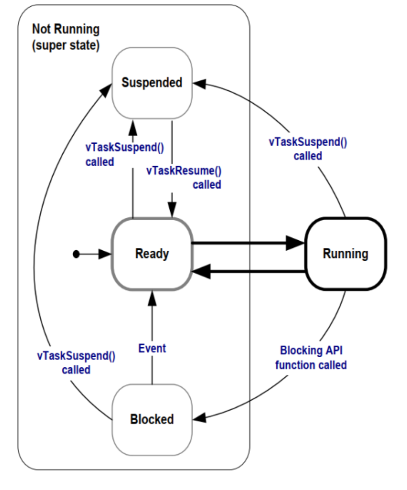

# FreeRTOS

### 1.FreeRTOS的移植步骤

1、添加FreeRTOS源码：将FreeRTOS源码添加至基础工程、头文件路径等

2、FreeRTOSConfig.h ：添加FreeRTOSConfig.h 配置文件

3、修改SYSTEM文件：修改SYSTEM文件中的sys.c、delay.c、usart.c

4、修改中断相关文件：修改Systick中断、SVC中断、PendSV中断

5、添加应用程序：验证移植是否成功

### 2.任务状态

运行态，就绪态，阻塞态，挂起态

Running

Ready

Blocked

Suspended 



### 3.宏定义为空的作用？

我遇到了一个问题，在freertos中，systick_handler()函数中，如下

````c
/*-----------------------------------------------------------*/

#define portSET_INTERRUPT_MASK_FROM_ISR()         ulSetInterruptMask()

uint32_t ulSetInterruptMask( void ) __attribute__( ( naked ) ) PRIVILEGED_FUNCTION;

#define PRIVILEGED_FUNCTION //无MPU的宏定义
#define PRIVILEGED_FUNCTION     __attribute__( ( section( "privileged_functions" ) ) )//有MPU的版本的宏定义

void SysTick_Handler( void ) /* PRIVILEGED_FUNCTION */
{
    uint32_t ulPreviousMask;

    ulPreviousMask = portSET_INTERRUPT_MASK_FROM_ISR();
    {
        /* Increment the RTOS tick. */
        if( xTaskIncrementTick() != pdFALSE )
        {
            /* Pend a context switch. */
            portNVIC_INT_CTRL_REG = portNVIC_PENDSVSET_BIT;
        }
    }
    portCLEAR_INTERRUPT_MASK_FROM_ISR( ulPreviousMask );
}
/*-----------------------------------------------------------*/
````

在这两个`PRIVILEGED_FUNCTION`中，有无MPU的作用是不同的，所以这个宏定义可以有很好的移植性。

> 在 C 语言里，**宏（macro）** 是一种在 **编译前阶段（预处理阶段）** 就起作用的机制。
>
> 宏并不一定非得“执行代码”，它可以用来：
>
> - 控制编译器行为（比如 `__attribute__`）
> - 控制编译条件（比如 `#ifdef`）
> - 作为占位符，提高可读性与可移植性
>
> 所以，就算宏本身展开为空，它也可能起到“**语义标签**”的作用。

### 4.trace-hook功能

trace hooks 通常被用来：

| 用途         | 说明                                                      |
| ------------ | --------------------------------------------------------- |
| **调试**     | 打印系统运行状态、任务切换日志、tick 计数等               |
| **性能分析** | 测量任务执行时间、CPU占用率                               |
| **事件追踪** | 与可视化工具结合（Tracealyzer、FreeRTOS+Trace）生成时间线 |
| **统计信息** | 记录任务运行次数、等待次数等                              |
| **错误检测** | 检测意外的上下文切换或死锁情况                            |

FreeRTOS 设计了 **trace hooks**：

> “我不在内核中加入调试代码，但我在关键点留‘挂钩’，
>  你想监控，就自己往钩子上挂代码。”

这就像系统给你留了一堆“监听点（hooks）”，
 你可以选择性地“插上监听器”。

### 5.调度器的配置

FreeRTOSConfig.h中进行配置

|          配置项          |           含义           |
| :----------------------: | :----------------------: |
|  `configUSE_PREEMPTION`  | 是否允许高优先级任务抢占 |
| `configUSE_TIME_SLICING` | 同优先级任务是否轮流运行 |

### 6.代码执行时间

#### 6.1方法 1：使用 FreeRTOS Tick

适用于：使用 FreeRTOS 的系统。

```c
TickType_t t0 = xTaskGetTickCount();
YourFunction();
TickType_t t1 = xTaskGetTickCount();

printf("Used %d ticks (~%d ms)\n", t1 - t0, (t1 - t0) * portTICK_PERIOD_MS);

```

优点

- 非常简单。
- 不需要额外硬件。

缺点

- 精度只有 **Tick 等级（通常 1ms 或 10ms）**，无法测量微秒级的函数。
- 不适合短函数。

#### 6.2方法 2：使用 DWT Cycle Counter

适用于：Cortex-M3/M4/M7（ARM 内置 Cycle 计数器）

初始化：

```c
CoreDebug->DEMCR |= CoreDebug_DEMCR_TRCENA_Msk;
DWT->CYCCNT = 0;
DWT->CTRL |= DWT_CTRL_CYCCNTENA_Msk;
```

测量：

```c
uint32_t c0 = DWT->CYCCNT;
YourFunction();
uint32_t c1 = DWT->CYCCNT;

float time_us = (c1 - c0) * 1.0f / (SystemCoreClock / 1000000.0f);
printf("Used %.2f us\n", time_us);
```

优点

- 精确到 CPU 周期级（纳秒级）。
- 对实时性分析最有价值。
- 开销非常小。

缺点

- 只能用在 Cortex-M3/M4/M7/M33，不支持 Cortex-M0/M0+。
- 需要开启 DWT。

#### 6.3方法 3：使用硬件定时器（Timer）

适用于：所有 MCU，包括 STM32 / NXP / TI DSP / 瑞萨等。

1. 初始化一个高精度定时器（例如 1MHz → 1us 分辨率）
2. 在执行前读取 CNT
3. 执行代码
4. 在执行后读取 CNT

```c
uint32_t t0 = TIM2->CNT;
YourFunction();
uint32_t t1 = TIM2->CNT;

printf("Used %d us\n", t1 - t0);
```

优点

- 不依赖系统 Tick，精度可非常高（1us、100ns）。
- 可跨平台。

缺点

- 需要配置定时器。
- 有溢出处理问题。

#### 6.4方法 4：使用 GPIO 翻转，示波器观察

代码：

```c
GPIO_SetPin(HIGH);
YourFunction();
GPIO_SetPin(LOW);
```

示波器看到的高电平时间就是执行时间。

优点

- 外部仪器测量，非常可靠、精确。
- 适合调试“任务执行占比”和“时间抖动”。

缺点

- 需要硬件仪器（示波器/LA）。
- 不适用于过短代码（过短可能看不到）。

#### 6.5方法 5：使用 FreeRTOS 运行时间统计

适用于：需要知道每个任务占多少 CPU。

打开配置：

```
#define configGENERATE_RUN_TIME_STATS 1
#define configUSE_STATS_FORMATTING_FUNCTIONS 1
```

实现计数器宏（常用 DWT/Timer）：

```
#define portCONFIGURE_TIMER_FOR_RUN_TIME_STATS()  (ulHighFrequencyTimerTicks = 0)
#define portGET_RUN_TIME_COUNTER_VALUE()          (ulHighFrequencyTimerTicks)
```

调用：

```
char buf[512];
vTaskGetRunTimeStats(buf);
printf("%s\n", buf);
```

输出类似：

```
TaskName        Time        %
-------------------------------
ScenseTask      30000       60%
CmdTask          5000       10%
IdleTask        10000       30%
```

优点

- 查看**整系统的 CPU 占用情况**。
- 判断**任务是否堵塞**、是否抢占。

缺点

- 不能测单个函数。
- 需要配置运行时间统计功能。

#### 📊 五种方法对比总结表

| 方法                  | 精度   | 适用场景         | 优点                 | 缺点                 |
| --------------------- | ------ | ---------------- | -------------------- | -------------------- |
| FreeRTOS Tick         | 毫秒级 | 任务级耗时       | 简单方便             | 精度低               |
| DWT Cycle Counter     | 纳秒级 | 精确测函数、算法 | 最精准最推荐         | 仅 M3/M4/M7 支持     |
| 硬件定时器            | 微秒级 | 通用 MCU         | 跨平台可靠           | 需配置 TIM           |
| GPIO 翻转 + 示波器    | 微秒级 | 测任务占比、抖动 | 外部仪器精确         | 需硬件，短函数不适用 |
| FreeRTOS 运行时间统计 | 百分比 | 任务 CPU 占用    | 看整体 CPU；定位卡顿 | 不能测函数           |

#### 应用

```c
添加头文件
#include "xtime_l.h"
    
    
static inline uint64_t get_time_ticks(void)
{
    XTime t;
    XTime_GetTime(&t);      // t 是 64bit 计数值
    return (uint64_t)t;
}

static inline uint64_t ticks_to_us(uint64_t dt_ticks)
{
    return (dt_ticks * 1000000ULL) / (uint64_t)COUNTS_PER_SECOND;
}

//main（）函数中
	XTime_StartTimer();     // 确保全局计时器开始跑
	XTime_SetTime(0);       // 可选：把当前计数清零，方便观感
//

//代码中
uint64_t t0 = get_time_ticks();
		//计算运算时间模块
uint64_t t1 = get_time_ticks();
uint64_t dt_ticks = t1 - t0;
uint64_t dt_us    = ticks_to_us(dt_ticks);
printf("timer cost: %llu us\r\n", dt_us);
		//计算运算时间模块
//代码中
```

### 7.Lwip初始化

init有两种，裸机模式和RTOS模式，lwip_init() 可以直接调用，但是裸机模式下需要手动去轮询。

模式 1：裸机模式 (`NO_SYS=1`)

直接调用 `lwip_init()`：

```c
int main(void)
{
    lwip_init();  // 直接调用
    
    while(1) {
        // 需要手动轮询
        ethernetif_input(netif);
        sys_check_timeouts();
    }
}
```

模式 2：带 RTOS 模式 (`NO_SYS=0`)

通常应该使用 `tcpip_init()` 而不是 `lwip_init()`：

```c
// 标准做法
void my_init(void)
{
    tcpip_init(NULL, NULL);  // 内部会调用 lwip_init() 并创建 tcpip 线程
}
```
