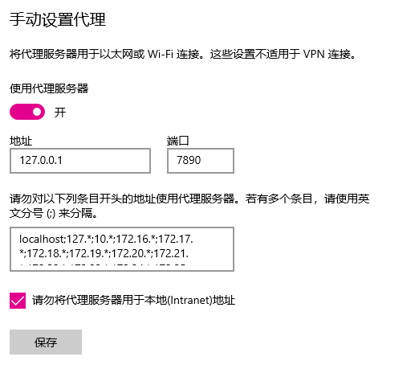

## Git

### 1.git如何切换分支

`git checkout 分支名` 

### 2.查看当前存在的分支

`git branch`

### 3.将分支代码合并到 master 分支的方法

```shell
# 1. 确保你在 master 分支
git checkout master

# 2. 拉取最新代码（确保本地 master 是最新的）
git pull origin master

# 3. 合并你的分支到 master
git merge 你的分支名

# 4. 解决可能的冲突（如果有）
# 5. 推送合并后的代码到远程
git push origin master
```

如何解决冲突问题？


### 4.如何取消 Git 的合并(merging)状态

- `git merge --abort`

这是最简单和推荐的方法，它会取消合并过程并尝试恢复到合并前的状态

- `git reset --hard HEAD`

这会重置当前分支到合并前的状态，丢弃所有未提交的更改（包括合并引入的更改）。

- `git reset --hard ORIG_HEAD`

`ORIG_HEAD` 是 Git 在危险操作前保存的上一个 HEAD 引用。

### 5.git如何设置用户名和邮箱

```shell
# 全局设置
git config --global user.name "John Doe"
git config --global user.email "john@example.com"

# 针对某个项目设置
cd /path/to/my-project
git config user.name "Jane Smith"
git config user.email "jane@project.com"
```

### 6.如何远程拉取文件

```shell
git clone 仓库的URL
```

### 7.无法连接服务器问题

> 报错：
>
> $ git push -u origin master fatal: unable to access 'https://github.com/shi1iu/ZYNQ.git/': Failed to connect to github.com port 4 43 after 21037 ms: Could not connect to server

解决：在git中修改代理的内容



`git config --global http.proxy http://127.0.0.1:7890`保持一致再git push即可。
