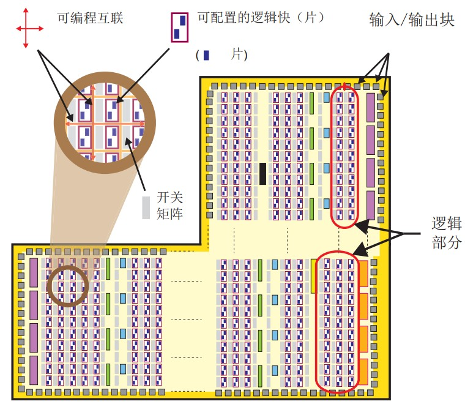
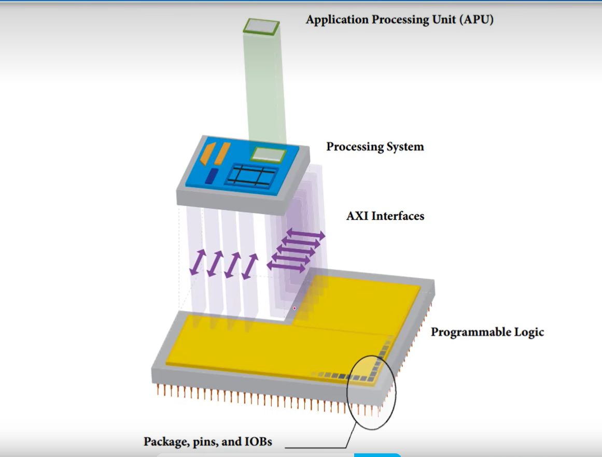
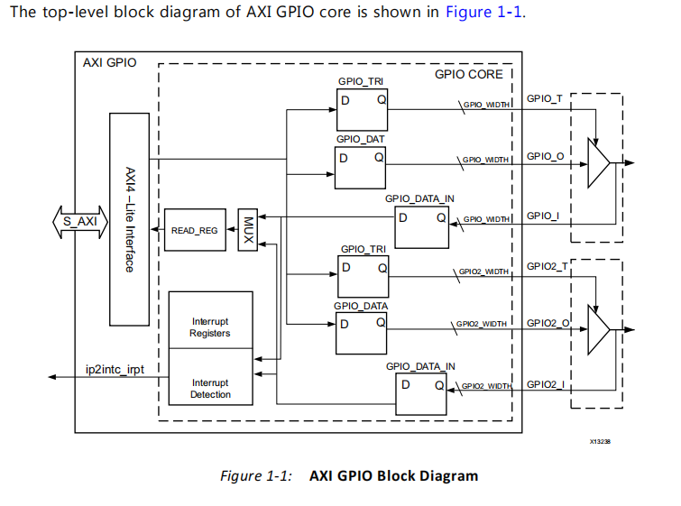
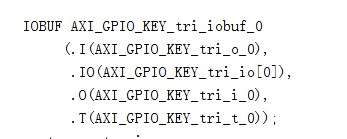
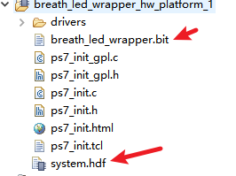
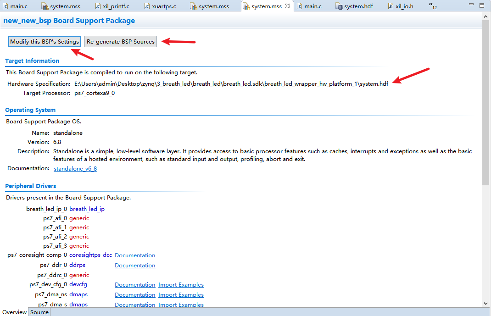
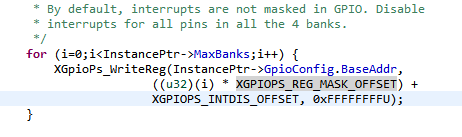

# ZYNQ

## SOC简介

资源集合在芯片上，数据传输快。






注意事项：

​	1. pl端的资源使用时，需要约束，而ps端的资源使用时并不需要约束，ps已经在物理层连接上了。


## 2.vivado例化是什么意思

> 在 **Vivado**（Xilinx 的 FPGA 设计工具）中，**“例化”**（Instantiation）是一个非常重要的概念，指的是在一个模块中**调用另一个模块**的过程。

## 3.petalinux的作用

方便配置、编译U-Boot、Linux内核以及根文件系统

```shell
$: cat ~/.bashrc 命令行打开，自动启动该脚本
```

```shell
petalinux-boot     //启动开发板
petalinux-config   //配置
petalinux-package  //打包
petalinux-util		//
petalinux-build   //编译
petalinux-create  //创建
petalinux-upgrade //
```

## 4.技术手册

Zynq - 7000 SoC 技术参考手册 (UG585)

Zynq - UltraScale+ 技术参考手册(UG1085)

## 5.领航者选择器件

**xc7z020clg400-2**

**MT41J256M16RE-125**

### 5.1  中断控制mio按键

​	 GIC 中断控制器配置在mpsoc中，配置ICC 和 ICD。

​	`XPS_EFUSE_BASEADDR`的地址在ug585没找到，目前应该是不开放给客户。

arm的中断处理机制

**异常的概念**

异常是计算机系统中一种突发事件或错误情况，它打破了正常的程序执行流程，需要特殊处理。异常可能由硬件错误、软件错误或外部事件引发，例如访问无效的内存地址、除以零、非法指令、IO错误、中断等。

异常源

|                       |                       |
| --------------------- | --------------------- |
| FIQ                   | 快速中断请求 引脚有效 |
| IRQ                   | 外部中断请求 引脚有效 |
| Reset                 | 复位电平有效          |
| Software Interrupt    | 执行swi指令           |
| Data Abort            | 数据终止              |
| Prefetch Abort        | 指令预取终止          |
| Undefined Instruction | 遇到不能处理的指令    |

## 6.使用axi gpio

axi协议支持以下三种类型的接口：

- AXI4 
- AXI4-Lite
- AXI4-Stream

axi-gpio要想与ps互联，需要使用axi-interconect连接

AXI 互联 IP（AXI Interconnect）用于连接 AXI 存储器映射（memory-mapped）的主器件和从器件。



gpio_t用于控制gpio的方向



bd生成文件中，IOBUF是三态缓冲器。

## 7.RAM

**RAM（Random Access Memory，随机存取存储器）** 是计算机和嵌入式系统中一种 **用于存放临时数据** 的存储器。

- **随机访问**：任何内存地址都能在相同时间内被访问（不像硬盘、磁带需要顺序读写）
- **易失性**：断电后数据会丢失（区别于 Flash、ROM 等非易失性存储）

RAM并不是外设，它是系统内存的一部分，直接挂在总线上或集成在芯片内部，**供 CPU/程序直接访问**。

**分类**：

| 类型      | 特点                             | 用途                      |
| --------- | -------------------------------- | ------------------------- |
| SRAM      | 静态 RAM，速度快，容量小，功耗高 | MCU 内置、缓存、Zynq BRAM |
| DRAM      | 动态 RAM，速度略慢，容量大       | DDR3/4，Zynq PS DDR       |
| SDRAM     | 同步 DRAM，时钟同步              | DDR 系列                  |
| BRAM/URAM | 可编程逻辑中内置的块内存         | FPGA 中高速缓存           |

混淆点：DDR是外设吗？

DDR 是一种 RAM（内存类型），不是外设，它是 CPU 用来运行程序和存储数据的主内存。外设是需要工具控制的，而RAM并不需要。

## 8.掩码的作用

**掩码存在的根本原因：**
 ➡️ **我们需要从一个寄存器中访问或控制某一部分（某几位）信息，而不是全部位。**

从一个整体中精确控制/提取/修改某几位数据的手段，是操作硬件寄存器最基本、最关键的工具之一。

## 7.中断实现AXI_GPIO

axi_gpio连接key，触发中断，串口打印，led灯切换。

```c
#include "xparameters.h"
#include "xgpiops.h"
#include "xgpio.h"
#include "xscugic.h"
#include "xil_exception.h"
#include "sleep.h"
#include <xil_printf.h>
#include "xplatform_info.h"


#define GPIOPS_DEVICE_ID		XPAR_XGPIOPS_0_DEVICE_ID  //LED
#define AXI_GPIO_DEVICE_ID	XPAR_AXI_GPIO_0_DEVICE_ID //KEY
#define SCUGIC_ID			XPAR_SCUGIC_0_DEVICE_ID   //中断
#define AXI_GPIO_INT_ID 	XPAR_FABRIC_GPIO_0_VEC_ID //axi_gpio中断ID

#define KEY_CHANNEL 1
#define KEY_CH1_MASK   XGPIO_IR_CH1_MASK


XGpioPs gpiops_inst;
XGpio   axi_gpio_inst;
XScuGic scugic_inst;
int  led_value=1;

void instance_init();
static void intr_handler(void *callback_ref);


int main()
{
	//初始化
	instance_init();
	XGpioPs_WritePin(&gpiops_inst,0,0);
	xil_printf("AXI_GPIO interrupt test.\r\n");

	while(1);

}

void instance_init()
{

	//led
	XGpioPs_Config * gpiops_cfg_ptr;
	gpiops_cfg_ptr = XGpioPs_LookupConfig(GPIOPS_DEVICE_ID);
	XGpioPs_CfgInitialize(&gpiops_inst,gpiops_cfg_ptr,gpiops_cfg_ptr->BaseAddr);

	XGpioPs_SetDirection(&gpiops_inst, 0, 1);
	XGpioPs_SetOutputEnable(&gpiops_inst, 0, led_value);

	//axi_key
	XGpio_Config * axi_gpio_cfg_ptr;
	axi_gpio_cfg_ptr = XGpio_LookupConfig(XPAR_AXI_GPIO_0_DEVICE_ID);
	XGpio_CfgInitialize(&axi_gpio_inst,axi_gpio_cfg_ptr,axi_gpio_cfg_ptr->BaseAddress);

	XGpio_SetDataDirection(&axi_gpio_inst,KEY_CHANNEL,1);
	XGpio_InterruptEnable(&axi_gpio_inst,KEY_CH1_MASK);
	XGpio_InterruptGlobalEnable(&axi_gpio_inst);

	//GIC
	XScuGic_Config * scugic_cfg_ptr;
	scugic_cfg_ptr = XScuGic_LookupConfig(SCUGIC_ID);
	XScuGic_CfgInitialize(&scugic_inst,scugic_cfg_ptr,scugic_cfg_ptr->CpuBaseAddress);
	XScuGic_SetPriorityTriggerType(&scugic_inst,AXI_GPIO_INT_ID,0xA0,0x01);
	XScuGic_Connect(&scugic_inst,AXI_GPIO_INT_ID,(Xil_ExceptionHandler)intr_handler,(void *)&axi_gpio_inst);
	XScuGic_Enable(&scugic_inst,AXI_GPIO_INT_ID);

	//exception
	Xil_ExceptionInit();
	Xil_ExceptionRegisterHandler(XIL_EXCEPTION_ID_INT,(Xil_ExceptionHandler)XScuGic_InterruptHandler,&scugic_inst);
	Xil_ExceptionEnable();

}

static void intr_handler(void *callback_ref)
{
	XGpio *axi_gpio_inst_ptr = (XGpio*) callback_ref;
	usleep(2000);
	if(XGpio_DiscreteRead(axi_gpio_inst_ptr,1)==0)
	{
		xil_printf("Interrupt Detected!\r\n");
		led_value= ~led_value;
		XGpioPs_WritePin(&gpiops_inst,0,led_value&0x1);
		XGpio_InterruptDisable(axi_gpio_inst_ptr,KEY_CH1_MASK);
	}
		XGpio_InterruptClear(axi_gpio_inst_ptr,KEY_CH1_MASK);
		XGpio_InterruptEnable(axi_gpio_inst_ptr,KEY_CH1_MASK);
}

```

## 8.开发文件的流程

1. 在block_design中生成的bit文件和.hdf文件(.xsa文件)。
2. 生成的.bit和.xsa文件会生成给platform文件中。
3. 创建工程的时候会跟随着生成一个bsp文件，bsp文件是跟随着platform。

如果你在开发SDK的过程中修改了配置信息，需要重新生成.hdf和.bit文件，再然后，需要查看platform文件是否已经更新，如果更新完，再去修改bsp文件，修改完记得重新构建一下bsp。bsp生成完基本就一样同步了。





这些都是关联的，自己注意一下。

## 9.报错

### 9.1 AP transaction error, DAP status f0000021

这个问题最本质的意思是**逻辑工程与软件工程不匹配，导致软件不能正常访问硬件资源**。

查看发现DDR的配置没修改，没法使用。

## 10.eFuse电子熔丝

用于访问 **eFuse (电子熔丝)** 的基地址。eFuse 是一个存储器区域，用于存储硬件信息和一些设备的配置选项，它通常用于存储设备的唯一标识符、加密密钥、配置选项等。

### 10.1. eFuse 的用途

- **唯一标识符 (UID)**：存储设备的唯一硬件标识符。
- **设备配置**：存储一些设备的配置选项，可能涉及硬件的功能启用或禁用。
- **安全存储**：存储加密密钥或其他安全相关信息。
- **制造商信息**：存储芯片的制造日期、版本等信息。

### 10.2. 如何访问 eFuse

要访问 eFuse 存储区域，Xilinx 提供了相关的驱动程序和函数，例如：

- `XEfuse_Read()`：用于读取 eFuse 的值。
- `XEfuse_Write()`：用于写入 eFuse（通常在硬件设计阶段就配置好）。

## 11.zynq的GPIO配置中断禁止位



`XGPIOPS_REG_MASK_OFFSET` 的作用是，bank 0 的第一个mio和bank 1 的第一个mio 的地址差值。

## 12.xadc采集自带传感器信息

```c
#include "stdio.h"
#include "xadcps.h"
#include "xparameters.h"
#include "xil_printf.h"


#define ADC_DEVICE_ID XPAR_XADCPS_0_DEVICE_ID

XAdcPs ADC_instance;

void adc_init(XAdcPs* ADC_instance_ptr)
{
	XAdcPs_Config * config_ptr;
	config_ptr  = XAdcPs_LookupConfig(ADC_DEVICE_ID);
	XAdcPs_CfgInitialize(ADC_instance_ptr,config_ptr,config_ptr->BaseAddress);
}


int main ()
{
	adc_init(&ADC_instance);
	XAdcPs_SetSequencerMode(&ADC_instance,XADCPS_SEQ_MODE_SAFE);

	s32 tempature;

	u16 raw_adc_value;

	raw_adc_value = XAdcPs_GetAdcData(&ADC_instance,XADCPS_CH_TEMP);
	tempature = XAdcPs_RawToTemperature(raw_adc_value);
	xil_printf("tempature = %d\r\n",tempature);

}

```

