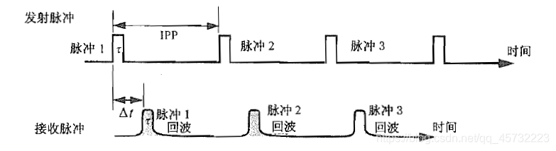
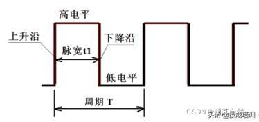
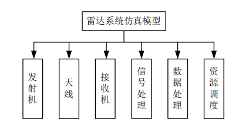
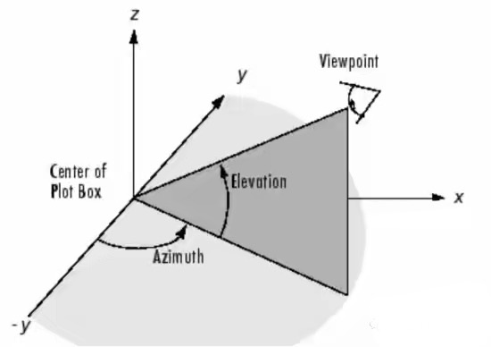
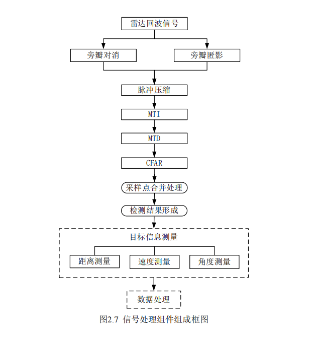
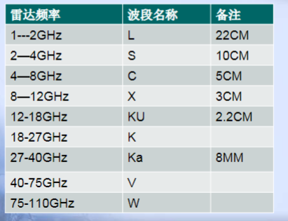

# 雷达

## 1.脉冲调制





> ​    PRT  (pulse repetition time)：脉冲重复时间。雷达发射脉冲串，单个脉冲的时间。
>
> ​    PRF（pulse repetition frequency）:脉冲重复频率，脉冲重复时间的倒数
>
> ​    PRI（Pulse Repetition Interval）：脉冲重复间隔

脉冲信号.*载频信号

## 2.采样中遇到的问题,2.1kHz采1kHz的信号，有包络。

- **包络的根源**：非同步采样（采样率非信号频率整数倍）导致相位偏移累积，形成周期性幅度调制。
- **包络频率**：由 ∣2f0−fs∣∣2*f*0−*f**s*∣ 决定（本例为 100 Hz100Hz）。

### 2.1. **采样率与信号频率的非整数倍关系**

- **信号周期** T0=1 ms*T*0=1ms（频率 f0=1 kHz*f*0=1kHz），**采样周期** Ts=1/2100 s≈0.476 ms*T**s*=1/2100s≈0.476ms。
- 每 **10 个信号周期**（共 10 ms10ms）对应 **21 个采样点**，即采样点位置随时间逐渐偏移信号波形的相位。
- **相位偏移累积**导致采样点振幅呈现周期性起伏，形成低频包络。

------

### 2.2. **拍频效应**

- 包络频率由 **采样率与信号频率的差值** 决定：

  fbeat=∣2f0−fs∣=∣2×1 kHz−2.1 kHz∣=0.1 kHz (100 Hz).*f*beat=∣2*f*0−*f**s*∣=∣2×1kHz−2.1kHz∣=0.1kHz(100Hz).

- 采样后的离散信号等效于 **1 kHz 信号与 100 Hz 低频包络的乘积**，表现为振幅周期性变化（如图）。

------

### 2.3. **时域中的包络形成**

- **示例**：以 fs=2.1 kHz*f**s*=2.1kHz 采样 f0=1 kHz*f*0=1kHz 的正弦波：
  - 前几个采样点的振幅依次为：0→0.156→−0.309→0.454→−0.574→...0→0.156→−0.309→0.454→−0.574→...
  - 振幅呈现 **100 Hz 周期性波动**，形成包络。
- **本质**：采样点相位偏移导致时域信号的幅度调制。

------

### 2.4. **频谱视角**

- 采样后的频谱以 fs=2.1 kHz*f**s*=2.1kHz 周期重复，原始信号 f0=1 kHz*f*0=1kHz 的镜像频率为 fs−f0=1.1 kHz*f**s*−*f*0=1.1kHz。
- 若未严格滤波，镜像频率 1.1 kHz1.1kHz 与基带信号 1 kHz1kHz 叠加，产生 **差频 100 Hz100Hz**，表现为包络。

------

### 2.5. **数学推导**

- 采样序列的相位增量：

  Δϕ=2πf0fs=2π×12.1≈0.952π rad/sample.Δ*ϕ*=2*π**f**s**f*0=2*π*×2.11≈0.952*π*rad/sample.

- 每经过 2121 个采样点（对应 10 ms10ms），相位累积 21×0.952π≈20π21×0.952*π*≈20*π*，即完成 1010 个信号周期，包络周期为 10 ms10ms（100 Hz100Hz）。

------

### 2.6. **结论**

- **包络的根源**：非同步采样（采样率非信号频率整数倍）导致相位偏移累积，形成周期性幅度调制。
- xxxxxxxxxx matlabrmse = sqrt(mean((x_est - x_true).^2 + (y_est - y_true).^2));matlab
- **实际意义**：工程中需确保采样率远高于奈奎斯特率（如 4×f04×*f*0），避免此类现象干扰信号恢复。

## 3.生成方波信号，信号失真。

```matlab
t=0:1:100;
pluse_train = square(2*t,50);

figure;

plot(t,pluse_train);
xlabel('时间 (秒)');
ylabel('幅度');
title('基带脉冲信号');

 xlim([0 10]);  % 显示前0.1秒
 ylim([-1.1 1.1]); % 限制Y轴范围
```

方波并不是单一频率的信号，上升沿下降沿都有很高的奇次谐波分量，导致1Hz的采样率采集不到。

### 3.1使用这种方式产生特定频率的方波信号

```matlab
f = 1;  % 频率1 Hz
pluse_train = square(2*pi*f*t, 50);  % 角频率2πf
```

## 4.雷达系统仿真模型组成



- 发射机组件主要产生雷达发射信号，对空域目标进行探测；
- 天线组件同时拥有收发功能，在发射链路将雷达发射信号辐射到空间中，在接收链路接收由发射信号经目标和其它环境反射回来的回波信号；
- 接收机组件对天线组件传送的雷达回波信号进行噪声叠加、放大等预处理；
- 信号处理组件将经接收机组件处理后的回波信号进行干扰、杂波抑制，提取目标距离、速度及角度信息；
- 数据处理组件负责对信号处理组件测量的目标信息进行关联、滤波，形成目标航迹信息，并且产生对目标下一步操作的雷达任务请求；
- 资源调度组件接收数据处理组件输出的任务请求列表，按照自适应调度准则提取、安排当前工作时间段内雷达的工作任务。

## 5.什么是驻留

**雷达中的“驻留”**：在雷达领域，"驻留"通常指雷达系统或者目标在某一频率或者位置上的持续停留或存在。具体来说，雷达中的“驻留”可能指：

- **频率驻留**：雷达发射机在某一固定频率上持续工作。
- **时间驻留**：指雷达对某一特定区域或目标进行持续探测，保持时间较长，以提高信号的采集效率或增强目标识别。
- **目标驻留**：目标在雷达波束的覆盖范围内持续停留，从而使雷达能够持续追踪该目标。

## 6.天线方向图



1. 方位角（Azimuth）：指的是罗盘方位，假设有一个圆形的空间。那么在XY平面上，就可以通过一个一坐标轴为边的圆心角来作为方位的确定。
2. 俯仰角（Elevation）：有时也称海拔高度。当方位角测量完毕之后，需要用俯仰角来描述被观察物体相对于观察者的高度。这时候就通过Z轴方向和XY平面的角度来进行确认。φ就是方位角、θ就是俯仰角。

## 7.信号处理组件



## 8.雷达种类

波段：



## 9.航迹关联

### 🔹 常见的航迹关联方法分类

#### 1. **最近邻（Nearest Neighbor, NN）方法**

- **思想**：每条航迹只和最近的一个量测匹配。
- **优点**：实现简单，计算量小。
- **缺点**：容易误判（尤其是目标密集或噪声多时）。
- **变种**：最近邻标准滤波（NNSF）。

------

#### 2. **概率数据关联（Probabilistic Data Association, PDA）**

- **思想**：不是只选一个量测，而是把门限内的多个量测都考虑进来，按概率加权更新。
- **特点**：对单目标、多虚警环境更鲁棒。
- **扩展**：联合概率数据关联（JPDA）用于多目标场景。

------

#### 3. **联合概率数据关联（Joint PDA, JPDA）**

- **思想**：同时考虑多条航迹和所有观测的联合概率，避免冲突。
- **优点**：多目标跟踪中性能很好。
- **缺点**：计算复杂度高，随着目标数和点迹数指数增长。

------

#### 4. **多假设跟踪（Multiple Hypothesis Tracking, MHT）**

- **思想**：不马上确定航迹归属，而是保留多个可能的假设，随着时间推进逐步淘汰不合理的假设。
- **优点**：最优概率意义下接近最优。
- **缺点**：计算和存储开销极大，需要剪枝。

------

#### 5. **全局最近邻 / 匈牙利算法（Global Nearest Neighbor, GNN）**

- **思想**：通过求解**分配问题**（assignment problem），使整体匹配代价最小。
- **常用算法**：Hungarian 算法（Kuhn-Munkres 算法）。
- **优点**：比单纯最近邻更合理。

------

#### 6. **基于聚类的方法**

- 在点迹密集时，先用 **聚类（K-means、DBSCAN、GMM）** 对点迹分组，然后再关联到航迹。
- 好处：可以减少点迹混淆，提高 JPDA 或 GNN 的效率。

------

#### 7. **现代方法（机器学习 / 深度学习）**

- **图匹配方法**：把航迹和量测建成二分图，用图神经网络（GNN）学习匹配。
- **强化学习方法**：把航迹关联看成决策问题，通过 RL 学习分配策略。
- **端到端方法**：深度网络直接输入雷达点云，输出航迹。

## 10.信号的IQ路

```LESS
        ↑ Q (正交分量)
        |
        |      •  ← 信号向量 (I,Q)
        |
        |__________→ I (同相信号)

```

| 参数             | 数学表达式                                                   | 含义         |
| ---------------- | ------------------------------------------------------------ | ------------ |
| 幅度（Envelope） | A=I2+Q2A = \sqrt{I^2 + Q^2}                                  | 信号瞬时强度 |
| 相位（Phase）    | ϕ=tan⁡−1(Q/I)\phi = \tan^{-1}(Q/I)                            | 信号瞬时相位 |
| 实际信号         | s(t)=Icos⁡(2πfct)−Qsin⁡(2πfct)s(t) = I\cos(2\pi f_c t) - Q\sin(2\pi f_c t) | 完整带通信号 |

## 11.雷达坐标变换

### 11.1地心系2阵面系

```matlab
% 输入参数
lambda = deg2rad(2.250000063520503e+02);  % 经度（单位：弧度）
phi = deg2rad(0);     % 纬度（单位：弧度）
h = -2.013892148621380;                % 高度（单位：米）
R = 6378137;             % 地球半径（单位：米）
X_target = 200;      % 目标在地心系的X坐标
Y_target = 100;      % 目标在地心系的Y坐标
Z_target = 0;      % 目标在地心系的Z坐标

% 雷达朝向与俯仰角
psi = deg2rad(45);  % 雷达方向角（单位：弧度）
theta = deg2rad(0);  % 雷达俯仰角（单位：弧度）

% 将雷达位置转换为地心坐标系
X_radar = (R + h) * cos(phi) * cos(lambda);
Y_radar = (R + h) * cos(phi) * sin(lambda);
Z_radar = (R + h) * sin(phi);

X_radar = 100;
Y_radar = 0;
Z_radar = 0;

% 计算旋转矩阵
R_y = [cos(theta), 0, sin(theta); 
       0, 1, 0; 
       -sin(theta), 0, cos(theta)]; % 绕Y轴旋转（俯仰角）

R_z = [cos(psi), -sin(psi), 0; 
       sin(psi), cos(psi), 0; 
       0, 0, 1]; % 绕Z轴旋转（方向角）

R_total = R_y * R_z;  % 总的旋转矩阵

% 目标坐标在地心坐标系中的相对位置
X_rel = X_target - X_radar;
Y_rel = Y_target - Y_radar;
Z_rel = Z_target - Z_radar;

% 使用旋转矩阵将目标坐标从地心系转换到阵面系
target_in_zhenmian = R_total * [X_rel; Y_rel; Z_rel];

% 输出转换后的坐标
disp('目标在阵面系中的坐标:');
disp(target_in_zhenmian);

```

### 11.2站心系2阵面系

```matlab
% 输入参数
X_target = 目标_X;      % 目标在站心系的X坐标
Y_target = 目标_Y;      % 目标在站心系的Y坐标
Z_target = 目标_Z;      % 目标在站心系的Z坐标

% 雷达朝向与俯仰角
psi = deg2rad(方向角);  % 雷达方向角（单位：弧度）
theta = deg2rad(俯仰角);  % 雷达俯仰角（单位：弧度）

% 计算旋转矩阵
R_y = [cos(theta), 0, sin(theta); 
       0, 1, 0; 
       -sin(theta), 0, cos(theta)]; % 绕Y轴旋转（俯仰角）

R_z = [cos(psi), -sin(psi), 0; 
       sin(psi), cos(psi), 0; 
       0, 0, 1]; % 绕Z轴旋转（方向角）

R_total = R_y * R_z;  % 总的旋转矩阵

% 将目标坐标从站心系转换到阵面系
target_in_阵面系 = R_total * [X_target; Y_target; Z_target];

% 输出转换后的坐标
disp('目标在阵面系中的坐标:');
disp(target_in_阵面系);

```

### 11.3地心系2站心系

```matlab
function ENU_RCS = WGS84_RCS2ENU_RCS(Target_WGS84_RCS,Base_WGS84_RCS,Base_WGS84_SCS)
%地心直角系（WGS84_RCS）： O为地球质心
%         X轴指向BIH 1984.0的零子午面和CTP赤道的交点
%         Y轴与X,Z成右手系
%         Z轴指向BIH （国际时间服务机构）1984.0定义的协议地球极（CTP)方向
%站心系（北天东坐标系,ENU_RCS）： O为站心
%         X轴指向北极（天文北向）
%         Y轴为铅垂线，指向天向为正
%         Z轴在水准面内，与X，Y构成右手系
Rx = [1,0,0;...
      0,cosd(90-Base_WGS84_SCS.B),sind(90-Base_WGS84_SCS.B);... %X轴旋转矩阵
      0,-sind(90-Base_WGS84_SCS.B),cosd(90-Base_WGS84_SCS.B)];
Rz = [cosd(90+Base_WGS84_SCS.L),sind(90+Base_WGS84_SCS.L),0;...     %沿Z轴旋转矩阵
      -sind(90+Base_WGS84_SCS.L),cosd(90+Base_WGS84_SCS.L),0;...
      0,0,1];

ENU_RCS_array= Rx*Rz*([Target_WGS84_RCS.X;Target_WGS84_RCS.Y;Target_WGS84_RCS.Z]-[Base_WGS84_RCS.X;Base_WGS84_RCS.Y;Base_WGS84_RCS.Z]);

ENU_RCS.X=ENU_RCS_array(1);
ENU_RCS.Y=ENU_RCS_array(2);
ENU_RCS.Z=ENU_RCS_array(3);
end
```

