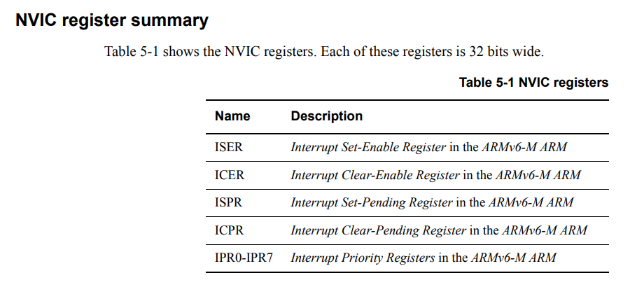

## 1.ADC

1.1 adc的指标参数

- 转换速率：KSPS/MSPS，表示每秒采样千/百万次。
- 线性表：
- 分辨率：

1.2 adc 的位数

​	eg:12位   “12 位”表示可以用 2¹² = **4096 个离散等级**来表示一个模拟量。代表分辨率。

## 2.中断

NVIC （cortex-m系列）

GIC   （cortex-a系列）

这两种中断控制器

NVIC介绍

