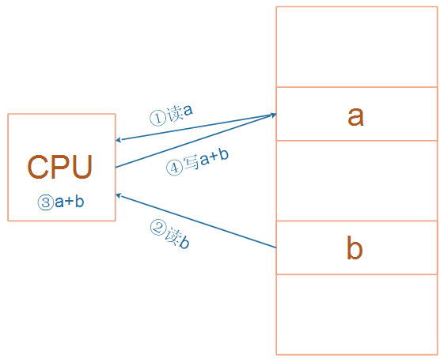

# 嵌入式开发C语言补充

## 1. 变量与指针

2个口诀：

* 变量变量，能变，就是能读能写，必定在内存里
* 指针指针，保存的是地址，32位处理器中地址都是32位的，无论是什么类型的指针变量，都是4字节


## 2. 变量赋值

### 2.1 简单的变量赋值

```c
int a;
a = 1;
a = 'A';
```


### 2.2 关键字

* volatile 易变，不会被CPU优化，即每次写变量后，都会被重新放到内存中
* const 常量，不能直接更改，需要使用指针才能进行赋值
* static 静态，作用域只能在此文件夹中
* extern 声明，定义后在其他文件需要使用时需要声明


### 2.2 引入结构体、结构体赋值

* 结构体是不占资源，变量才占资源


### 2.3 类型转换

int <=== char

struct <=== struct pointer


### 2.4 指针、函数指针

函数指针 eg： void (*add) (int a)    指针是一个变量，所以为函数指针

指针函数：void * add ()  是一个函数，但是是指针的函数。  

typedef和define并不是一回事，

```c
typedef int A
typedef int * A //可以用A代替int *
```

 

## 3. 链表操作


## 4. ARM架构




## 5. 几条汇编指令

* load
* store
* B、BL
* add、sub
* and/bic


## 6. 几个核心问题

* 有值的全局变量的初始化

  * 类似memcpy，把Flash上的数据段，整体拷贝到RAM

* 初始值为0、没有初始化的全局变量，怎么初始化？

  * 有100万个这样的变量
  * 这100万个变量，都保存在Flash上吗？
  * 这些变量在内存里都放在ZI段
  * 类似memset，把ZI段全部清零

* 才去调用main函数

* 局部变量在哪？

* 局部变量的初始化

* 栈的作用


