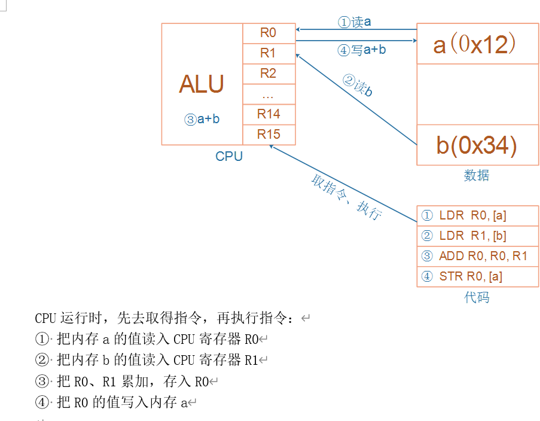

# 嵌入式开发C语言补充

## 1. 变量与指针

2个口诀：

* 变量变量，能变，就是能读能写，必定在内存里
* 指针指针，保存的是地址，32位处理器中地址都是32位的，无论是什么类型的指针变量，都是4字节


## 2. 变量赋值

### 2.1 简单的变量赋值

```c
int a;
a = 1;
a = 'A';
```


### 2.2 关键字

* volatile 易变，不会被CPU优化，即每次写变量后，都会被重新放到内存中
* const 常量，不能直接更改，需要使用指针才能进行赋值
* static 静态，作用域只能在此文件夹中
* extern 声明，定义后在其他文件需要使用时需要声明


### 2.2 引入结构体、结构体赋值

* 结构体是不占资源，变量才占资源


### 2.3 类型转换

int <=== char

struct <=== struct pointer


### 2.4 指针、函数指针

函数指针 eg： void (*add) (int a)    指针是一个变量，所以为函数指针

指针函数：void * add ()  是一个函数，但是是指针的函数。  

typedef和define并不是一回事，

```c
typedef int A
typedef int * A //可以用A代替int *
```

 

## 3. 链表操作


## 4. ARM架构





## 5. 几条汇编指令

* load
* store
* B、BL
* add、sub
* and/bic


## 6. 几个核心问题

* 有值的全局变量的初始化

  * 类似memcpy，把Flash上的数据段，整体拷贝到RAM

* 初始值为0、没有初始化的全局变量，怎么初始化？

  * 有100万个这样的变量
  * 这100万个变量，都保存在Flash上吗？
  * 这些变量在内存里都放在ZI段
  * 类似memset，把ZI段全部清零

* 才去调用main函数

* 局部变量在哪？

* 局部变量的初始化

* 栈的作用

## 7.嵌入式常用的宏定义

```c
#include <stdio.h>

#define GET_BYTE(address) (*(volatile unsigned char*)(address))

int main() {
    unsigned char byteValue = GET_BYTE(0x12345678);  // 获取地址上的一个字节

    printf("Byte value: %02X\n", byteValue);  // 打印字节值

    return 0;
}
```

### 7.1求最大、最小值

```c
#include <stdio.h>

#define MAX(a, b) ((a) > (b) ? (a) : (b))
#define MIN(a, b) ((a) < (b) ? (a) : (b))

int main() {
    int num1 = 10;
    int num2 = 20;

    int maxNum = MAX(num1, num2);
    int minNum = MIN(num1, num2);

    printf("Max value: %d\n", maxNum);
    printf("Min value: %d\n", minNum);

    return 0;
}
```

### 7.2得到一个field在结构体(struct)中的偏移量

```c
#include <stdio.h>

#define FIELD_OFFSET(struct_type, field_name) ((size_t)(&(((struct_type*)0)->field_name)))

typedef struct {
    int field1;
    char field2;
    double field3;
} MyStruct;

int main() {
    size_t offset = FIELD_OFFSET(MyStruct, field2);
    printf("Offset of field2: %zu bytes\n", offset);

    return 0;
}
```

### 7.3得到一个结构体中field所占用的字节数

```c
#include <stdio.h>

#define FIELD_SIZE(struct_type, field_name) (sizeof(((struct_type*)0)->field_name))

typedef struct {
    int field1;
    char field2;
    double field3;
} MyStruct;

int main() {
    size_t size = FIELD_SIZE(MyStruct, field2);
    printf("Size of field2: %zu bytes\n", size);

    return 0;
}
```

### 7.4按照LSB格式把两个字节转化为一个Word

```c
#include <stdio.h>

#define BYTES_TO_WORD(lsb, msb) (((unsigned short)(msb) << 8) | (lsb))

int main() {
    unsigned char lsb = 0x34;
    unsigned char msb = 0x12;

    unsigned short word = BYTES_TO_WORD(lsb, msb);

    printf("Word: 0x%04X\n", word);

    return 0;
}
```

### 7.5按照LSB格式把一个Word转化为两个字节

```c
#include <stdio.h>

#define WORD_TO_BYTES(word, lsb, msb) \
    do { \
        lsb = (unsigned char)(word & 0xFF); \
        msb = (unsigned char)((word >> 8) & 0xFF); \
    } while (0)

int main() {
    unsigned short word = 0xABCD;
    unsigned char lsb, msb;

    WORD_TO_BYTES(word, lsb, msb);

    printf("LSB: 0x%02X\n", lsb);
    printf("MSB: 0x%02X\n", msb);

    return 0;
}
```

### 7.6得到一个变量的地址(word宽度)

```c
#define GET_ADDRESS(var) ((word *) &(var))
```

### 7.7得到一个字的高位和低位字节

```c
#include <stdio.h>

#define GET_HIGH_BYTE(word) ((unsigned char)(((word) >> 8) & 0xFF))
#define GET_LOW_BYTE(word) ((unsigned char)((word) & 0xFF))

int main() {
    unsigned short word = 0xABCD;
    unsigned char highByte = GET_HIGH_BYTE(word);
    unsigned char lowByte = GET_LOW_BYTE(word);

    printf("High byte: 0x%02X\n", highByte);
    printf("Low byte: 0x%02X\n", lowByte);

    return 0;
}
```

### 7.8返回一个比X大的最接近的8的倍数

```c
#include <stdio.h>

#define ROUND_UP_TO_EIGHT(x) (((x) + 7) & (~7))

int main() {
    int x = 17;
    int roundedUp = ROUND_UP_TO_EIGHT(x);

    printf("Original value: %d\n", x);
    printf("Rounded up to nearest multiple of 8: %d\n", roundedUp);

    return 0;
}

```

### 7.9将一个字母转换为大写

```c
#include <stdio.h>

#define TO_UPPERCASE(letter) ((letter >= 'a' && letter <= 'z') ? (letter - 'a' + 'A') : letter)

int main() {
    char letter = 'a';
    char uppercaseLetter = TO_UPPERCASE(letter);

    printf("Original letter: %c\n", letter);
    printf("Uppercase letter: %c\n", uppercaseLetter);

    return 0;
}
```

### 7.10防止溢出的一个方法

```c
#define INC_SAT( val ) (val = ((val)+1 > (val)) ? (val)+1 : (val))
```

### 7.11返回数组元素的个数

```c
#include <stdio.h>

#define ARRAY_LENGTH(arr) (sizeof(arr) / sizeof((arr)[0]))

int main() {
    int numbers[] = {1, 2, 3, 4, 5};
    int length = ARRAY_LENGTH(numbers);

    printf("Array length: %d\n", length);

    return 0;
}
```

### 7.12对于IO空间映射在存储空间的结构，输入输出处理

```c
#define inp(port) (*((volatile byte *) (port)))
#define inpw(port) (*((volatile word *) (port)))
#define inpdw(port) (*((volatile dword *)(port)))
#define outp(port, val) (*((volatile byte *) (port)) = ((byte) (val)))
#define outpw(port, val) (*((volatile word *) (port)) = ((word) (val)))
#define outpdw(port, val) (*((volatile dword *) (port)) = ((dword) (val)))
```

这个宏的目的是将一个字节的数据写入指定的端口。它使用类型转换和指针操作来确保对端口的访问是以字节为单位的，并且使用 volatile 修饰符来确保编译器不会进行优化和缓存操作，以防止出现意外的行为。

使用此宏时，你可以通过调用 outp(port, val) 来将 val 的值写入 port 端口。例如：
```c
outp(0x1000, 0xFF);
```

这将将值 `0xFF` 写入地址 `0x1000` 的端口。

### 7.13宏定义防止使用时错误

用小括号包含。

**比如计算平方：**

```c
#define SQUARE(x) ((x) * (x))
```

在使用 `SQUARE` 宏时，将要计算平方的表达式用小括号包含起来：

```c
int result = SQUARE((2 + 3));
```

用do{}while(0)语句包含多语句防止错误

```c
#include <stdio.h>

#define MULTI_STATEMENT_MACRO(x, y) \
    do { \
        printf("Executing statement 1\n"); \
        printf("x + y = %d\n", (x) + (y)); \
        printf("Executing statement 2\n"); \
    } while(0)
```

