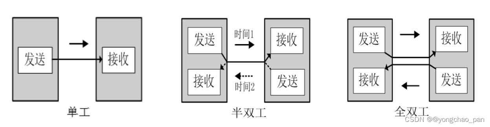
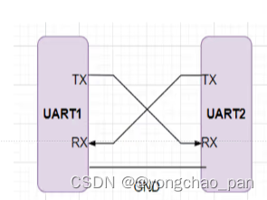
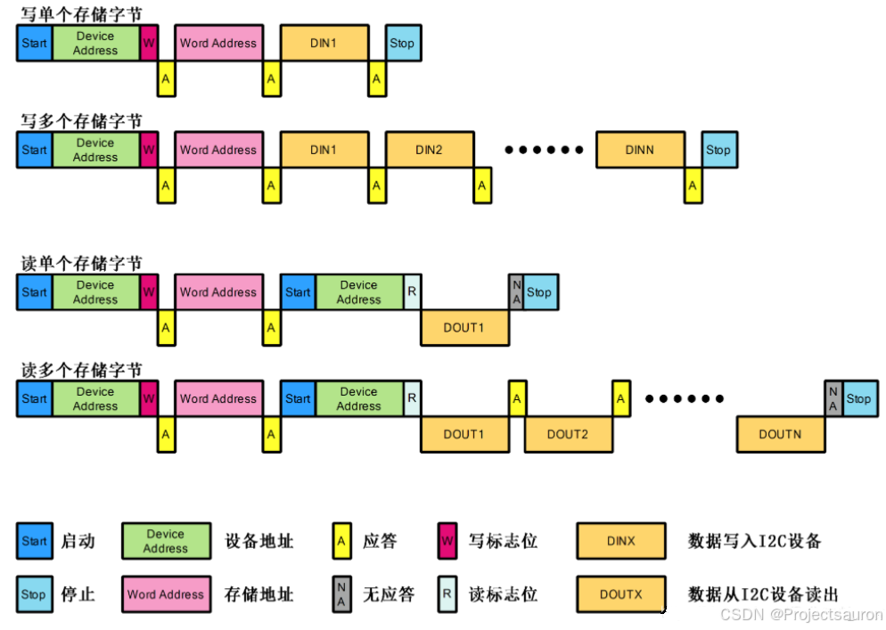
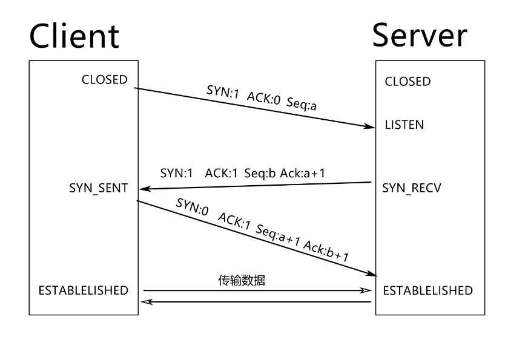
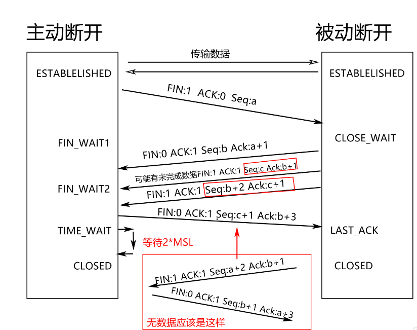
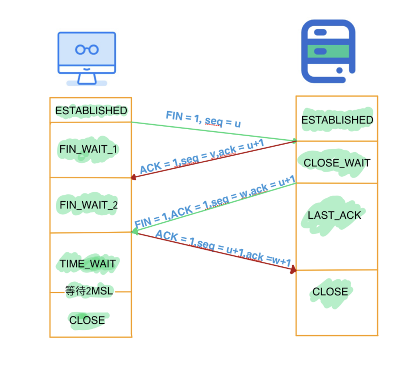
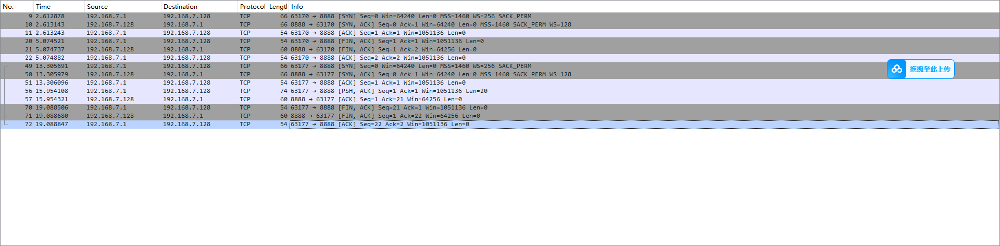
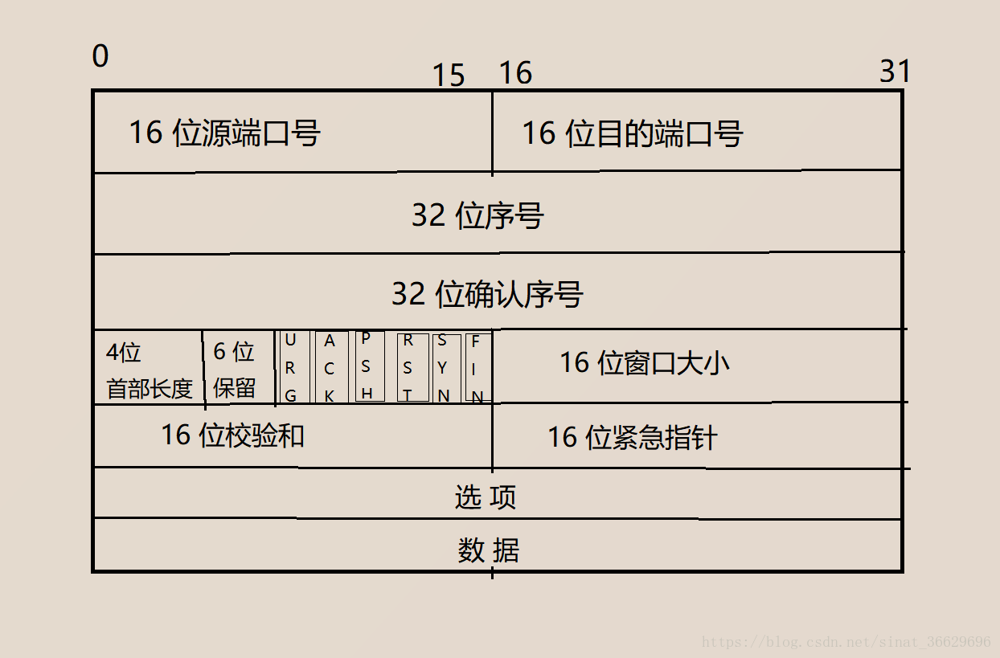

## 通信总线的分类


## 一、通信分类


### （一）串行通信

- 工作方式： 在串行通信中，数据位按照顺序依次传输，也就是说，每一位数据都依次发送或接收。
- 优点： 相对简单，不容易出现数据冲突。由于只有一个通信通道，线路的布线较为简单。
- 缺点： 速度相对较慢，因为每次只能传输一个位。不适合大量数据的快速传输。
- 典型应用：USB，UART，光纤通信。

### （二）并行通信

- 工作方式： 在并行通信中，多个数据位同时传输。每个位都有自己的通道，可以独立传输，从而在同一时刻传输多个位。
- 优点： 速度相对较快，尤其适合大量数据的快速传输。适用于需要同时处理多个数据位的情况。
- 缺点： 复杂度较高，占用引脚资源多。容易出现数据同步问题。
- 典型应用：适用于短距离传输，长距离传输成本高。

### （三）同步通信

- 工作方式： 在同步通信中，数据的发送和接收是在预定的时钟信号下进行的。数据的发送方和接收方需要共享相同的时钟源，以确保数据的同步。
- 优点： 数据传输的时序清晰，易于管理和理解。适用于需要实时性和精确同步的应用。
- 缺点： 高频时钟衰减较快，通信过程易发生信号畸变，相位偏移，因此传输距离不宜过长。
- 典型应用：I2C，HDMI，CPU与内存接口等。

### （四）异步通信

- 工作方式： 在异步通信中，数据的发送和接收不依赖于共享时钟信号。每个数据块之间有一定的间隔，而不需要严格的时序同步。通信设备会使用起始位和停止位来标识数据块的开始和结束。
- 优点： 较为灵活，不需要精确的时钟同步。传输媒介简单，传输距离长。
- 缺点： 在高速传输和长距离通信时，由于没有同步的时钟，可能会出现数据失真。接收端解码复杂性增加，可靠性降低。
- 典型应用：UART，USB1.1，USB2.0，光纤通信。

### （五）单工通信

- 定义： 单工通信是一种单向通信模式，数据只能在一个方向上传输。通常，一个设备是发送者，而另一个设备是接收者。
- 特点： 通信双方只能在一个特定的方向上传输信息，其中一个设备只能发送，而另一个只能接收。
- 例子： 无线电广播、电视广播等。

### （六）半双工通信

- 定义： 半双工通信是一种双向通信模式，但是通信双方不能同时进行数据传输。在任意时刻，一个设备可以发送，而另一个设备可以接收，但不能同时进行。
- 特点： 数据传输是双向的，但是不能同时发生，需要在发送和接收之间切换。
- 例子： 对讲机、传统的无线电通信等。

### （七）全双工通信

- 定义： 全双工通信是一种双向通信模式，其中通信的双方能够同时进行发送和接收操作，允许双方同时传输数据。
- 特点： 双方可以在同一时间内同时发送和接收数据，实现真正的双向通信。
- 例子： 电话通话、互联网语音通话、典型的计算机网络通信等。





### 1.UART

> 通用异步收发器

参考资料[UART串口通信](https://blog.csdn.net/m0_58427556/article/details/135302591?ops_request_misc=%257B%2522request%255Fid%2522%253A%25229ce9c4c971358bbd60f0faf97c3965c6%2522%252C%2522scm%2522%253A%252220140713.130102334..%2522%257D&request_id=9ce9c4c971358bbd60f0faf97c3965c6&biz_id=0&utm_medium=distribute.pc_search_result.none-task-blog-2~blog~top_positive~default-1-135302591-null-null.nonecase&utm_term=uart%E4%B8%B2%E5%8F%A3%E9%80%9A%E4%BF%A1&spm=1018.2226.3001.4450)。

#### 1.1 比特率和波特率

- 比特率单位bps(bit per second)，每秒钟传送的bit的数量。
- 波特率单位Band，每秒钟传输码元的个数。

#### 1.2电气连接



#### 1.3数据帧


- ​    空闲位：线路上为高电平，即逻辑值为1。
- ​    起始位：逻辑值为0时，表示字符帧的开始。
- ​    数据位：先发低位再发高位。
- ​    校验位：奇偶校验。
- ​    停止位：高电平代表一个字符帧结束。


### 2.IIC

> IIC 协议（***Inter-Integrated Circuit***，可简写为 ***I2C***），是一种用于各种电子设备之间进行通信和数据交换的串行通信协议。它是由飞利浦（Philips）公司于 1982 年首次提出并推广的一种简单、高效、低成本的通信协议。

#### 2.1单个/多个字节的写入/读取



**写入单个字节**
  向从机设备的某一个寄存器写一个字节数据：开始信号+设备地址(7位)+读/写(1位)+等待从机应答+寄存器地址(8位)+等待从机应答+要写的数据(8位)+等待从机应答+终止信号。

**写入多个字节**
  向从机设备的某一个寄存器写多个字节数据：开始信号+设备地址(7位)+读/写(1位)+等待从机应答+寄存器地址(8位)+等待从机应答+要写的数据_1(8位)+等待从机应答+要写的数据_2(8位)+等待从机应答+······+要写的数据_N(8位)+等待从机应答+终止信号。

**读取一个字节**
  从机设备的某一个寄存器读取一个字节数据：开始信号+设备地址(7位)+写(1位)+等待从机应答+数据地址(8位)+等待从机应答+开始信号+设备地址(7位)+读(1位)+等待从机应答+从机返回读取数据_1(8位)+主机(接收机)不再应答+终止信号

**读取多个字节**
  从从机设备的某一个寄存器读取多个字节数据：开始信号+设备地址(7位)+写(1位)+等待从机应答+数据地址(8位)+等待从机应答+开始信号+设备地址(7位)+读(1位)+等待从机应答+从机返回读取数据_1(8位)+主机(接收机)应答+从机返回读取数据_2(8位)+主机(接收机)应答+......+从机返回读取数据_N(8位)+主机(接收机)不再应答+终止信号。

### 3. SPI

> SPI (Serial Peripheral interface)，顾名思义就是串行外围设备接口。是Motorola(摩托罗拉)首先在其MC68HCXX系列处理器上定义的。
>
> SPI，是一种高速的，全双工，同步的通信总线，并且在芯片的管脚上只占用四根线，节约了芯片的管脚，同时为PCB的布局上节省空间，提供方便，主要应用在 EEPROM，FLASH，实时时钟，AD转换器，还有数字信号处理器和数字信号解码器之间。


### 4.CAN


[一文读懂CAN总线协议 (超详细配34张高清图)](https://blog.csdn.net/qq_35057766/article/details/135580884)

### 5.USB

### 6.GPIO

### 7.WIFI

### 8.SDIO

### 9.Ethernet

[嵌入式网络接口设计](https://blog.csdn.net/u010783226/article/details/131633603?ops_request_misc=&request_id=&biz_id=102&utm_term=%E5%B5%8C%E5%85%A5%E5%BC%8F%E7%BD%91%E5%8F%A3%E5%A6%82%E4%BD%95%E5%BC%80%E5%8F%91&utm_medium=distribute.pc_search_result.none-task-blog-2~all~sobaiduweb~default-0-131633603.142^v102^pc_search_result_base7&spm=1018.2226.3001.4187)

### 10.TCP/IP协议

**三次握手**



**四次挥手**





**为什么通过wireshark抓包三次挥手抓到3包？**



Fin第一个包：首个挥手包本端告诉对端的FIN和本端告诉对端的ACK合并在了一起
在TCP连接中，关闭连接通常是由其中一方发起的。当一方决定关闭连接时，它会发送一个带有FIN标志的TCP报文，表示它已经没有数据要发送了，并请求关闭连接。但是，由于TCP是可靠传输协议，它需要确保发送的报文能够被对方正确接收。因此，在发送FIN标志的同时，也需要发送ACK标志，表示它已经确认接收到对方发送的数据，并且已经准备好关闭连接。这就是为什么第一次挥手发送的TCP报文中带有FIN和ACK标志的原因。只不过在实际及大多数人的理论中经常忽略这个ACK包
Fin第二个包：**对端的FIN和对端回复本端FIN的ACK合并在一起**
Fin第三个包：本端回复对端的FIN的ACK

linux下跑例程，windows使用串口调试助手

```c
#include <stdio.h>
#include <stdlib.h>
#include <string.h>
#include <unistd.h>
#include <pthread.h>
#include <semaphore.h>
#include <netinet/in.h>
#include <arpa/inet.h>

#define PORT 8888
#define BUFFER_SIZE 10
#define MAX_MSG_LEN 1024
#define MAX_CLIENTS 5

// 缓冲区结构
char message_buffer[BUFFER_SIZE][MAX_MSG_LEN];
int in = 0, out = 0;

// 同步机制
pthread_mutex_t mutex;
sem_t full_slots, empty_slots;

// 网络接收线程（生产者）
void* client_handler(void* arg) {
    int client_fd = *(int*)arg;
    free(arg);
    char recv_buf[MAX_MSG_LEN];

    while (1) {
        int bytes = recv(client_fd, recv_buf, sizeof(recv_buf) - 1, 0);
        if (bytes <= 0) {
            printf("🔌 客户端断开连接\n");
            close(client_fd);
            break;
        }
        recv_buf[bytes] = '\0';

        sem_wait(&empty_slots);
        pthread_mutex_lock(&mutex);

        strncpy(message_buffer[in], recv_buf, MAX_MSG_LEN);
        printf("📥 接收到消息 -> 缓冲区[%d]: %s", in, message_buffer[in]);
        in = (in + 1) % BUFFER_SIZE;

        pthread_mutex_unlock(&mutex);
        sem_post(&full_slots);
    }

    return NULL;
}

// 消费者线程：不断处理消息
void* message_consumer(void* arg) {
    while (1) {
        sem_wait(&full_slots);
        pthread_mutex_lock(&mutex);

        char msg[MAX_MSG_LEN];
        strncpy(msg, message_buffer[out], MAX_MSG_LEN);
        out = (out + 1) % BUFFER_SIZE;

        pthread_mutex_unlock(&mutex);
        sem_post(&empty_slots);

        printf("📤 消费消息 <- 缓冲区: %s", msg);
        // 这里可以扩展为写文件、发送响应、日志处理等
    }
    return NULL;
}

int main() {
    int server_fd, *client_fd;
    struct sockaddr_in server_addr, client_addr;
    socklen_t client_len = sizeof(client_addr);

    // 初始化
    pthread_mutex_init(&mutex, NULL);
    sem_init(&empty_slots, 0, BUFFER_SIZE);
    sem_init(&full_slots, 0, 0);

    // 启动消费者线程
    pthread_t consumer_tid;
    pthread_create(&consumer_tid, NULL, message_consumer, NULL);

    // 建立 socket 监听
    server_fd = socket(AF_INET, SOCK_STREAM, 0);
    server_addr.sin_family = AF_INET;
    server_addr.sin_port = htons(PORT);
    server_addr.sin_addr.s_addr = INADDR_ANY;
    bind(server_fd, (struct sockaddr*)&server_addr, sizeof(server_addr));
    listen(server_fd, MAX_CLIENTS);
    printf("🚀 服务器启动，端口：%d\n", PORT);

    while (1) {
        client_fd = malloc(sizeof(int));
        *client_fd = accept(server_fd, (struct sockaddr*)&client_addr, &client_len);
        printf("✅ 新客户端连接：%s\n", inet_ntoa(client_addr.sin_addr));

        pthread_t tid;
        pthread_create(&tid, NULL, client_handler, client_fd);
        pthread_detach(tid); // 客户端线程自动释放资源
    }

    close(server_fd);
    pthread_mutex_destroy(&mutex);
    sem_destroy(&empty_slots);
    sem_destroy(&full_slots);
    return 0;
}
```


