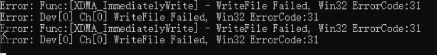
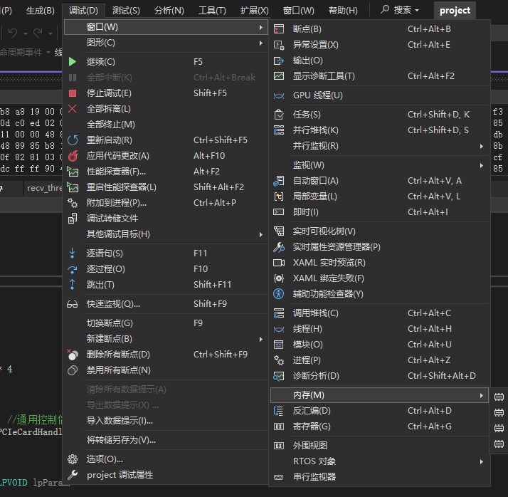
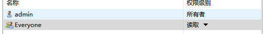
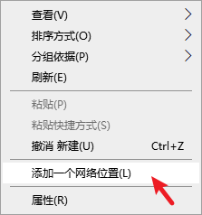
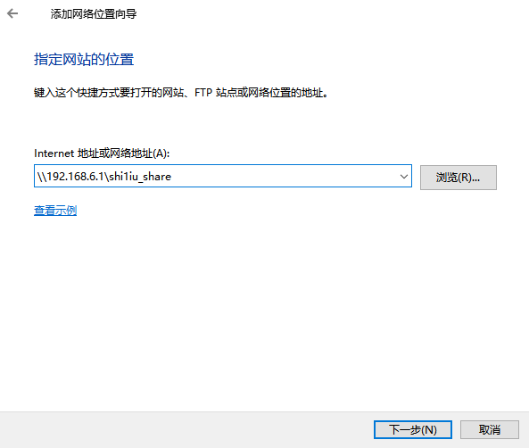
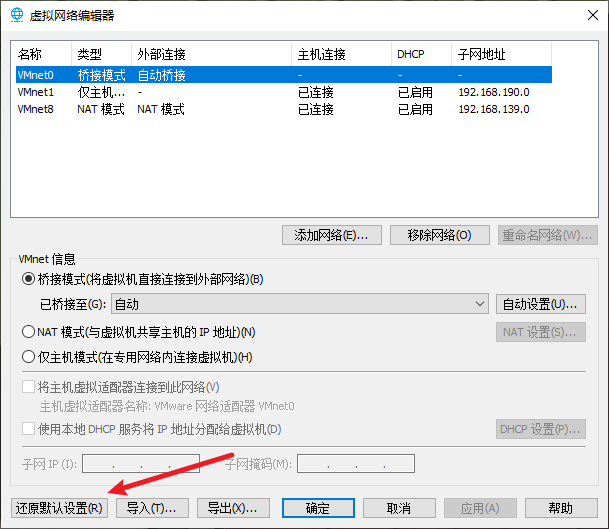
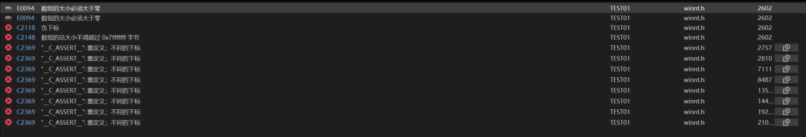

### 项目学习

### 1.memcpy()函数

```c
#include <string.h>  // 必须包含的头文件
void* memcpy(void* dest, const void* src, size_t n);
```

- `dest`: 目标内存地址（复制后的数据存放位置）
- `src`: 源内存地址（需要复制的数据来源）
- `n`: 要复制的字节数

xxxxxxxxxx :CALCulate:MARKer2:MAXimum:NEXT  ; 将标记2设为下一个峰值（次峰）:CALCulate:MARKer2:Y?            ; 查询次峰幅度（单位：dBm）scpi

### 2.memset()函数

```c
#include <string.h>  // 必须包含的头文件
void* memset(void* ptr, int value, size_t n);
```

- `ptr`: 目标内存地址（需初始化的起始位置）
- `value`: 要设置的字节值（实际会转换为 `unsigned char` 类型，范围 0~255）
- `n`: 要设置的字节数


### 3.malloc()函数

```c
#include <stdlib.h>  // 必须包含的头文件
void* malloc(size_t size);	
```

参数：

- `size`: 要分配的字节数（若为0，行为由编译器定义，通常返回NULL或无效指针）

返回值：

- 成功：返回指向分配内存起始地址的`void*`类型指针（需类型转换）

- 失败：返回`NULL`（内存不足时） 

  需要使用`free()`来释放资源，否则会导致**内存泄漏**。
  
  eg:分配10个int类型的空间
  
  ```c
  int * p = (int *)malloc(sizeof(int)*10);
  free( p );
  ```
  
  
  
  

### 4.free()函数


### 5.TCP接收端解决粘包问题

```C
#include<stdio.h>
#include<windows.h>
#include"net.h"

#pragma pack(push, 1)

DWORD WINAPI recv_thread(LPVOID lpParam)
{
int size1, size2;
int len;
unsigned int head; // 使用无符号类型
while (1) {
    // 读取 head
    size1 = recv(clientSocket, &head, sizeof(int), 0);
    if (size1 <= 0) break;
    head = ntohl(head); // 转换字节序

    if (head == 0x55555555) { // 使用 == 进行比较
        // 读取 len
        size2 = recv(clientSocket, &len, sizeof(int), 0);
        if (size2 <= 0) break;
        len = len-8; // 转换字节序

        unsigned char* buff = malloc(len); // 使用无符号字符
        int total = 0;
        // 循环读取完整数据
        while (total < len) {
            int received = recv(clientSocket, buff + total, len - total, 0);
            if (received <= 0) break;
            total += received;
        }
        printf("len:%d\n", len);
        printf("Received %d bytes (hex):\n", size1 + size2 + total);
        for (int i = 0; i < total; i++) {
            printf("%02X ", buff[i]); // 正确显示无符号字节
        }
        printf("\n");
    }
}
}
```


### 6.`htonl()`、`ntohl()`函数

- `htonl`：host to neteork long 主机字节序转换为网络字节序
- `ntohl`：network to host long 网络字节序转换为主机字节序
- 网络字节序是大端
  - 主机端是小端

### 7.这个代码，解决粘包问题

```c
省略
#pragma pack(push, 1)
#define BUFFER_SIZE 4096

char buffer[BUFFER_SIZE];
size_t total_received = 0;
while (1) {
    int n = recv(clientSocket, buffer + total_received, BUFFER_SIZE - total_received, 0);
    if (n <= 0) {/* 处理错误 */ }
    total_received += n;
    // 解析可用数据
    while (total_received >= sizeof(MessageHeader_t)) 
    {
        MessageHeader_t* header = (MessageHeader_t*)buffer;
        int packet_length = (header->Messagelength);
        if (total_received >= packet_length)
        {
            // 完整数据包已接收
            recv_t* packet = (recv_t*)buffer;

           // process_packet(packet);
                     printf("%x\n", packet->MessageHeader.TargetAddress);
            // 移除已处理数据
            size_t remaining = total_received - packet_length;
            memmove(buffer, buffer + packet_length, remaining);
            total_received = remaining;
        }
        else 
        {
            break; // 等待更多数据
        }
    }
}
```

这个代码的逻辑就是buffer有一个缓冲区，然后通过`memove()`去移除 Messagelength 大小的数，判断如果不满足 Messagelength 大小，则再去 tcp 接收。解决问题。是一个好代码。

### 8.memmove()函数

```c
void *memmove(void *str1, const void *str2, size_t n)
```

- **str1** -- 指向用于存储复制内容的目标数组，类型强制转换为 void* 指针。
- **str2** -- 指向要复制的数据源，类型强制转换为 void* 指针。
- **n** -- 要被复制的字节数。

### 9.学习使用信号量

windows下：

- P操作：`WaitForSingleObject(信号量引用，等待时间)`
- V操作：`ReleaseSemaphore(信号量引用，加的值，原始值)`

### 10.发现问题

首先，malloc函数，通过一个buffer赋值给另外一个，应该赋值给另外一片区域，而不是在同一片区域内改变值。

### 11.量化因子

用于将连续的模拟信号或高精度数字信号转换为离散的低比特表示（如8-bit、4-bit等）。

```c 
#define Quantization_factor(bits)    (1ULL << (bits))
```

### 12.张康项目，写增益

- 每1ms都需要得出衰减，并计算出增益。
- 模拟增益：

### 13.写log函数

- `log()`

以e为底的函数

- `log10()`

以10为低的函数

### 14.赋值完显示 inf

显示 inf 是无限的意思，表示**无穷大**（infinite）。当浮点数的值超出其表示范围时，就会产生INF。

### 15.vs远程调试

1. 找到远程调试器，打开vs2022的版本的文件夹，找到 msvsmon.exe (可用everything找到)，复制粘贴到目标的调试机。
2. 在本地打开vs2022，将需要远程调试的工程属性打开


下面是调试机的设置，工具->选项进行设置，选无身份验证，这里照片没设置。


3. 在本地主机选择远程调试即可。

### 16.PCIE_Write报错



1. 考虑到自己否使用PCIE_Malloc()这个函数的错误

### 17.点目标计算的距离给FPGA发需要光速C

 ```math
 floor((2R/c)*fclk)
 ```

在量化部分多加这一步。

### 18.QT打包学习

1. 采用release版本进行编译
2. 搜索到qt的打包工具Qt 5.9 for Desktop
3. 将exe文件放入一个文件夹，进入qt打包软件，cd到那个文件夹，windeployqt xxx.exe即可

### 19.动态控制线程

```C
void UpdateThread(int new_temp) {
    // 1. 设置退出标志
    bExit = TRUE;
    
    // 2. 等待旧线程退出（最多等待5秒）
    if (hThread != NULL) {
        WaitForSingleObject(hThread, 5000);
        CloseHandle(hThread);
    }
    
    // 3. 更新信号量（根据新temp值创建新信号量）
    if (hSemaphore != NULL) CloseHandle(hSemaphore);
    hSemaphore = CreateSemaphore(NULL, new_temp, 100, NULL);
    
    // 4. 重置控制变量
    temp = new_temp;
    bExit = FALSE;
    
    // 5. 创建新线程
    hThread = (HANDLE)_beginthreadex(NULL, 0, ThreadProc, NULL, 0, NULL);
}
```

### 20.退出线程思路

#### 1.标志位控制法（最安全推荐）

```C
#include <Windows.h>

// 共享退出标志
volatile BOOL g_ExitFlag = FALSE;

DWORD WINAPI WorkerThread(LPVOID lpParam)
{
    while (!g_ExitFlag)  // 循环检测退出标志
    {
        // 执行工作任务
        printf("线程工作中...\n");
        Sleep(1000);
    }
    
    printf("线程正常退出\n");
    return 0;  // 安全退出线程
}

int main()
{
    HANDLE hThread = CreateThread(NULL, 0, WorkerThread, NULL, 0, NULL);
    
    Sleep(5000);  // 模拟运行5秒
    g_ExitFlag = TRUE;  // 设置退出标志
    
    WaitForSingleObject(hThread, INFINITE);  // 等待线程退出
    CloseHandle(hThread);
    return 0;
}
```

优势：通过`volatile`关键字确保标志可见性，使用`WaitForSingleObject`保证资源清理

#### 2.事件通知法（推荐用于复杂场景）

```C
HANDLE hExitEvent = NULL;

DWORD WINAPI WorkerThread(LPVOID lpParam)
{
    while (1)
    {
        // 检查事件状态（立即返回）
        if (WaitForSingleObject(hExitEvent, 0) == WAIT_OBJECT_0)
        {
            printf("收到退出事件\n");
            break;
        }
        
        // 执行工作任务
        printf("处理数据...\n");
        Sleep(1000);
    }
    
    printf("线程清理资源后退出\n");
    return 0;
}

int main()
{
    hExitEvent = CreateEvent(NULL, TRUE, FALSE, NULL);
    HANDLE hThread = CreateThread(NULL, 0, WorkerThread, NULL, 0, NULL);
    
    Sleep(3000);
    SetEvent(hExitEvent);  // 触发退出事件
    
    WaitForSingleObject(hThread, INFINITE);
    CloseHandle(hThread);
    CloseHandle(hExitEvent);
    return 0;
}
```

优势：可扩展多个同步对象，适合需要响应多种事件的线程

#### 3.强制终止法（应急使用）

```C
DWORD WINAPI CriticalThread(LPVOID lpParam)
{
    while (1) 
    {
        // 临界区操作（危险示例）
        printf("执行关键操作...\n");
        Sleep(1000);
    }
    return 0;
}

int main()
{
    HANDLE hThread = CreateThread(NULL, 0, CriticalThread, NULL, 0, NULL);
    
    Sleep(2000);
    
    if (TerminateThread(hThread, 0)) 
    {
        printf("线程已强制终止\n");
        // 注意：此处可能需要手动释放线程持有的资源
    }
    
    CloseHandle(hThread);
    return 0;
}
```

风险说明：

1. 可能导致内存泄漏（分配的内存未释放）
2. 文件句柄/网络连接未正常关闭
3. 可能破坏共享数据的一致性
4. DLL附着计数异常*4*

### 21.vs中调出内存



### 22.PCIE_WRITE返回值为0

遇到问题，fpga那边fifo满了。

### 23.共享文件夹建立

创建文件夹，属性，共享，共享把everyone打开，给权限。





这里都打开


使用时，在此电脑右键添加





or

win+r直接输入。

### 24.取整函数

1. **向上取整 `ceil()`**
   - 功能：返回不小于参数的最小整数
   - 示例：
     - ceil(3.2)=4*ce**i**l*(3.2)=4
     - ceil(−3.8)=−3*ce**i**l*(−3.8)=−3 *3*
2. **向下取整 `floor()`**
   - 功能：返回不大于参数的最大整数
   - 示例：
     - floor(3.8)=3*f**l**oor*(3.8)=3
     - floor(−3.2)=−4*f**l**oor*(−3.2)=−4 *3*
3. **四舍五入 `round()`（C99标准）**
   - 功能：返回最接近的整数（中间值向远离零方向取整）
   - 示例：
     - round(2.5)=3*ro**u**n**d*(2.5)=3
     - round(−2.5)=−3*ro**u**n**d*(−2.5)=−3
4. **截断取整 `trunc()`（C99标准）**
   - 功能：直接舍弃小数部分
   - 示例：
     - trunc(4.9)=4*t**r**u**n**c*(4.9)=4
     - trunc(−4.9)=−4*t**r**u**n**c*(−4.9)=−4

### 25.TCP连接，服务器连接多个客户端

> C语言，socket，TCP，写一个能任意让客户端断开和连接的，不能是一次性服务器，要稳定性高，并且能处理异常断开的处理，异常断开后仍然能够连接到客户端

```C
#include <stdio.h>
#include <stdlib.h>
#include <string.h>
#include <unistd.h>
#include <sys/socket.h>
#include <sys/types.h>
#include <netinet/in.h>
#include <arpa/inet.h>
#include <errno.h>

#define PORT 8080
#define MAX_CLIENTS 100
#define BUFFER_SIZE 1024

int main() {
    int server_fd, new_socket;
    struct sockaddr_in address;
    int opt = 1;
    int addrlen = sizeof(address);
    fd_set readfds;
    int client_sockets[MAX_CLIENTS] = { 0 };
    int max_sd;

    // 创建TCP socket
    if ((server_fd = socket(AF_INET, SOCK_STREAM, 0)) == 0) {
        perror("socket failed");
        exit(EXIT_FAILURE);
    }

    // 设置socket选项
    if (setsockopt(server_fd, SOL_SOCKET, SO_REUSEADDR, &opt, sizeof(opt))) {
        perror("setsockopt");
        exit(EXIT_FAILURE);
    }

    address.sin_family = AF_INET;
    address.sin_addr.s_addr = INADDR_ANY;
    address.sin_port = htons(PORT);

    // 绑定socket到端口
    if (bind(server_fd, (struct sockaddr*)&address, sizeof(address)) < 0) {
        perror("bind failed");
        exit(EXIT_FAILURE);
    }

    // 开始监听
    if (listen(server_fd, 5) < 0) {
        perror("listen");
        exit(EXIT_FAILURE);
    }

    printf("Server started on port %d\n", PORT);

    while (1) {
        FD_ZERO(&readfds);
        FD_SET(server_fd, &readfds);
        max_sd = server_fd;

        // 添加客户端socket到集合
        for (int i = 0; i < MAX_CLIENTS; i++) {
            if (client_sockets[i] > 0) {
                FD_SET(client_sockets[i], &readfds);
                if (client_sockets[i] > max_sd)
                    max_sd = client_sockets[i];
            }
        }

        // 等待活动
        int activity = select(max_sd + 1, &readfds, NULL, NULL, NULL);
        if ((activity < 0) && (errno != EINTR)) {
            perror("select error");
        }

        // 处理新连接
        if (FD_ISSET(server_fd, &readfds)) {
            if ((new_socket = accept(server_fd, (struct sockaddr*)&address, (socklen_t*)&addrlen)) < 0) {
                perror("accept");
                exit(EXIT_FAILURE);
            }

            printf("New connection: socket fd %d, IP %s, port %d\n",
                new_socket, inet_ntoa(address.sin_addr), ntohs(address.sin_port));

            // 添加到客户端数组
            for (int i = 0; i < MAX_CLIENTS; i++) {
                if (client_sockets[i] == 0) {
                    client_sockets[i] = new_socket;
                    printf("Adding to list of sockets as %d\n", i);
                    break;
                }
            }
        }

        // 处理客户端I/O
        for (int i = 0; i < MAX_CLIENTS; i++) {
            int sd = client_sockets[i];
            if (sd > 0 && FD_ISSET(sd, &readfds)) {
                char buffer[BUFFER_SIZE] = { 0 };
                int valread = read(sd, buffer, BUFFER_SIZE);

                // 客户端正常关闭
                if (valread == 0) {
                    getpeername(sd, (struct sockaddr*)&address, (socklen_t*)&addrlen);
                    printf("Client disconnected: IP %s, port %d\n",
                        inet_ntoa(address.sin_addr), ntohs(address.sin_port));
                    close(sd);
                    client_sockets[i] = 0;
                }
                // 处理异常断开
                else if (valread < 0) {
                    if (errno == ECONNRESET) {
                        printf("Client unexpectedly disconnected\n");
                    }
                    else {
                        perror("read error");
                    }
                    close(sd);
                    client_sockets[i] = 0;
                }
                // 处理接收到的数据
                else {
                    buffer[valread] = '\0';
                    printf("Received: %s\n", buffer);

                    // 回显数据
                    if (send(sd, buffer, valread, 0) != valread) {
                        perror("send error");
                        close(sd);
                        client_sockets[i] = 0;
                    }
                }
            }
        }
    }

    return 0;
}
```

setsockopt()

### 26.解决一次性服务器问题(zhangkang)

main.c

```c
// 接受连接的循环
while (1) {
    SOCKET newClient = accept(listenSocket, (struct sockaddr*)&clientAddr, &addrLen);
    if (newClient == INVALID_SOCKET) {
        perror("Accept failed");
        continue;
    }
    printf("New client connected\n");
    
    // 创建新线程处理该客户端
    HANDLE hRecvThread = CreateThread(NULL, 0, recv_thread, (LPVOID)newClient, 0, NULL);
    if (hRecvThread == NULL) {
        closesocket(newClient);
        fprintf(stderr, "Failed to create thread\n");
    } else {
        CloseHandle(hRecvThread); // 不等待线程结束，直接关闭句柄
    }
}
```

recv_thread.c

```c
DWORD WINAPI recv_thread(LPVOID lpParam) {
    SOCKET clientSocket = (SOCKET)lpParam;
    char buffer[BUFFER_SIZE];
    size_t total_received = 0;

    while (1) {
        int n = recv(clientSocket, buffer + total_received, BUFFER_SIZE - total_received, 0);
        if (n <= 0) {
            printf("Client disconnected\n");
            closesocket(clientSocket);
            return 0; // 线程退出
        }
        total_received += n;
        // 处理数据逻辑...
    }
    return 0;
}
```


1. **移除全局`clientSocket`**：通过线程参数传递每个客户端的套接字，避免多线程竞争。
2. **线程独立资源**：每个线程管理自己的套接字和缓冲区，确保数据隔离。
3. **循环接受连接**：主线程持续监听新连接，保证客户端可重连。

### 27.VMware中没有网络服务是什么原因？

可能是VMware NAT service服务没有启动。

> 打开VMware的虚拟网络编辑器，选择“还原默认设置”，这时它会自动删除所有的VMware网络服务和虚拟网卡并且重新安装，如果操作完之后VMware NAT service消失了，就再这样操作一次，应该能解决问题。



重启解决。

### 28.windows如何设置开机自启动程序

1. win+R打开输入`shell:startup`,即是开机自启的文件夹。
2. 有文件依赖的话，需要生成快捷方式。

### 29.如何添加虚拟网卡

设备管理器->选中网络适配器->操作->添加过时硬件->安装我手动从列表选择的硬件->网络适配器->Microsoft->Microsoft KM-TEST  配置IP信息

### 30.**多客户端加解包**

使用select技术+解包技术完成。

```c
#include <winsock2.h>
#include <ws2tcpip.h>
#include <stdio.h>
#include <string.h>

#pragma comment(lib, "ws2_32.lib")

#define PORT 8888
#define MAX_CLIENTS 64
#define BUFFER_SIZE 2048

#pragma pack(push, 1)
typedef struct {
    int Messagelength; // 总包长，含头部
    char Address;
    char a;
} MessageHeader_t;

typedef struct {
    MessageHeader_t MessageHeader;
    char neirong;
} recv_t;
#pragma pack(pop)

// 为每个客户端保存上下文信息
typedef struct {
    SOCKET sock;
    char buffer[BUFFER_SIZE];
    size_t total_received;
    int in_use; // 1=占用，0=空
} ClientContext;

ClientContext clients[MAX_CLIENTS];

// 查找或分配一个可用的 ClientContext
ClientContext* find_client(SOCKET sock) {
    for (int i = 0; i < MAX_CLIENTS; i++) {
        if (clients[i].in_use && clients[i].sock == sock)
            return &clients[i];
    }
    return NULL;
}

ClientContext* alloc_client(SOCKET sock) {
    for (int i = 0; i < MAX_CLIENTS; i++) {
        if (!clients[i].in_use) {
            clients[i].in_use = 1;
            clients[i].sock = sock;
            clients[i].total_received = 0;
            memset(clients[i].buffer, 0, BUFFER_SIZE);
            return &clients[i];
        }
    }
    return NULL;
}

void free_client(SOCKET sock) {
    for (int i = 0; i < MAX_CLIENTS; i++) {
        if (clients[i].in_use && clients[i].sock == sock) {
            clients[i].in_use = 0;
            clients[i].sock = INVALID_SOCKET;
            clients[i].total_received = 0;
            memset(clients[i].buffer, 0, BUFFER_SIZE);
            return;
        }
    }
}

// 处理客户端数据，自动拆包
void HandleClient(ClientContext* ctx, fd_set* readfds) {
    int n = recv(ctx->sock, ctx->buffer + ctx->total_received, BUFFER_SIZE - ctx->total_received, 0);
    if (n <= 0) {
        printf("Client disconnected. Socket=%d\n", (int)ctx->sock);
        closesocket(ctx->sock);
        FD_CLR(ctx->sock, readfds);
        free_client(ctx->sock);
        return;
    }
    ctx->total_received += n;

    // 处理粘包/半包
    while (ctx->total_received >= sizeof(MessageHeader_t)) {
        MessageHeader_t* header = (MessageHeader_t*)ctx->buffer;
        int packet_length = header->Messagelength;
        if (packet_length <= 0 || packet_length > BUFFER_SIZE) {
            printf("Invalid packet length: %d\n", packet_length);
            closesocket(ctx->sock);
            FD_CLR(ctx->sock, readfds);
            free_client(ctx->sock);
            return;
        }
        if (ctx->total_received >= packet_length) {
            recv_t* packet = (recv_t*)ctx->buffer;
            printf("[SOCK %d] 收到包: Length=%d, Addr=0x%x, a=0x%x, 内容=%c\n",
                (int)ctx->sock, packet->MessageHeader.Messagelength,
                packet->MessageHeader.Address, packet->MessageHeader.a, packet->neirong);

            // 回显包数据到客户端（示例）
            send(ctx->sock, ctx->buffer, packet_length, 0);

            // 移除已处理包
            size_t remaining = ctx->total_received - packet_length;
            memmove(ctx->buffer, ctx->buffer + packet_length, remaining);
            ctx->total_received = remaining;
        }
        else {
            break; // 还没收到完整包
        }
    }
}

int main() {
    WSADATA wsaData;
    SOCKET listenSocket, clientSocket;
    struct sockaddr_in addr, clientAddr;
    int addrLen;
    fd_set readfds;
    char ipStr[INET_ADDRSTRLEN];

    memset(clients, 0, sizeof(clients));
    for (int i = 0; i < MAX_CLIENTS; i++) clients[i].sock = INVALID_SOCKET;

    if (WSAStartup(MAKEWORD(2, 2), &wsaData) != 0) {
        printf("WSAStartup failed\n");
        return 1;
    }
    listenSocket = socket(AF_INET, SOCK_STREAM, 0);
    if (listenSocket == INVALID_SOCKET) {
        printf("Socket creation failed\n");
        WSACleanup();
        return 1;
    }

    addr.sin_family = AF_INET;
    addr.sin_port = htons(PORT);
    addr.sin_addr.s_addr = htonl(INADDR_ANY);

    if (bind(listenSocket, (SOCKADDR*)&addr, sizeof(addr)) == SOCKET_ERROR) {
        printf("Bind failed\n");
        closesocket(listenSocket);
        WSACleanup();
        return 1;
    }
    if (listen(listenSocket, SOMAXCONN) == SOCKET_ERROR) {
        printf("Listen failed\n");
        closesocket(listenSocket);
        WSACleanup();
        return 1;
    }

    FD_ZERO(&readfds);
    FD_SET(listenSocket, &readfds);

    printf("Waiting for client connections on port %d...\n", PORT);

    while (1) {
        fd_set copyfds = readfds;
        int maxfd = listenSocket;
        for (int i = 0; i < MAX_CLIENTS; i++) {
            if (clients[i].in_use && clients[i].sock != INVALID_SOCKET) {
                FD_SET(clients[i].sock, &copyfds);
                if (clients[i].sock > maxfd)
                    maxfd = clients[i].sock;
            }
        }

        int result = select(maxfd + 1, &copyfds, NULL, NULL, NULL);
        if (result == SOCKET_ERROR) {
            printf("select failed: %d\n", WSAGetLastError());
            break;
        }

        // 新连接
        if (FD_ISSET(listenSocket, &copyfds)) {
            addrLen = sizeof(clientAddr);
            clientSocket = accept(listenSocket, (SOCKADDR*)&clientAddr, &addrLen);
            if (clientSocket != INVALID_SOCKET) {
                InetNtop(AF_INET, &clientAddr.sin_addr, ipStr, sizeof(ipStr));
                printf("New client connected: %s:%d [SOCK %d]\n",
                    ipStr, ntohs(clientAddr.sin_port), (int)clientSocket);
                FD_SET(clientSocket, &readfds);
                if (!alloc_client(clientSocket)) {
                    printf("Too many clients!\n");
                    closesocket(clientSocket);
                    FD_CLR(clientSocket, &readfds);
                }
            }
        }

        // 处理所有客户端数据
        for (int i = 0; i < MAX_CLIENTS; i++) {
            if (clients[i].in_use && clients[i].sock != INVALID_SOCKET &&
                FD_ISSET(clients[i].sock, &copyfds)) {
                HandleClient(&clients[i], &readfds);
            }
        }
    }

    // 清理
    closesocket(listenSocket);
    for (int i = 0; i < MAX_CLIENTS; i++)
        if (clients[i].in_use && clients[i].sock != INVALID_SOCKET)
            closesocket(clients[i].sock);
    WSACleanup();
    return 0;
}

```

### 31.服务器代码

```c
#include <stdio.h>
#include <stdlib.h>
#include <string.h>
#include <winsock2.h>
#include <windows.h>

#pragma comment(lib, "ws2_32.lib")  // 链接 Winsock 库

#define MAX_CLIENTS 10

// 定义事件处理函数
void handle_client(SOCKET client_socket) {
    char buffer[1024];
    int bytes_received;

    // 读取客户端发送的数据
    while ((bytes_received = recv(client_socket, buffer, sizeof(buffer) - 1, 0)) > 0) {
        buffer[bytes_received] = '\0';  // Null-terminate the received data
        printf("Received from client: %s\n", buffer);

        // 这里可以根据需要处理数据并返回响应
        // 比如给客户端发送一些数据
        send(client_socket, "Message received\n", 18, 0);
    }

    if (bytes_received == 0) {
        printf("Client disconnected.\n");
    }
    else if (bytes_received == SOCKET_ERROR) {
        printf("recv failed: %d\n", WSAGetLastError());
    }

    // 关闭客户端连接
    closesocket(client_socket);
}

// 新线程入口函数
DWORD WINAPI client_thread(LPVOID param) {
    SOCKET client_socket = (SOCKET)param;
    handle_client(client_socket);
    return 0;
}

// 服务器主逻辑
int main() {
    WSADATA wsaData;
    SOCKET server_socket, client_socket;
    struct sockaddr_in server_addr, client_addr;
    int client_len = sizeof(client_addr);
    fd_set read_fds;
    SOCKET max_fd;
    int ret;

    // 初始化 Winsock
    if (WSAStartup(MAKEWORD(2, 2), &wsaData) != 0) {
        printf("WSAStartup failed: %d\n", WSAGetLastError());
        return 1;
    }

    // 创建服务器套接字
    server_socket = socket(AF_INET, SOCK_STREAM, 0);
    if (server_socket == INVALID_SOCKET) {
        printf("Socket creation failed: %d\n", WSAGetLastError());
        WSACleanup();
        return 1;
    }

    // 配置服务器地址
    memset(&server_addr, 0, sizeof(server_addr));
    server_addr.sin_family = AF_INET;
    server_addr.sin_addr.s_addr = INADDR_ANY;
    server_addr.sin_port = htons(8080);

    // 绑定服务器套接字
    if (bind(server_socket, (struct sockaddr*)&server_addr, sizeof(server_addr)) == SOCKET_ERROR) {
        printf("Bind failed: %d\n", WSAGetLastError());
        closesocket(server_socket);
        WSACleanup();
        return 1;
    }

    // 监听端口
    if (listen(server_socket, MAX_CLIENTS) == SOCKET_ERROR) {
        printf("Listen failed: %d\n", WSAGetLastError());
        closesocket(server_socket);
        WSACleanup();
        return 1;
    }

    printf("Server started, waiting for connections...\n");

    // 主服务器循环
    while (1) {
        // 清空套接字集
        FD_ZERO(&read_fds);
        FD_SET(server_socket, &read_fds);
        max_fd = server_socket;

        // 等待客户端连接
        ret = select(0, &read_fds, NULL, NULL, NULL);
        if (ret == SOCKET_ERROR) {
            printf("select failed: %d\n", WSAGetLastError());
            break;
        }

        // 检查是否有客户端请求连接
        if (FD_ISSET(server_socket, &read_fds)) {
            client_socket = accept(server_socket, (struct sockaddr*)&client_addr, &client_len);
            if (client_socket == INVALID_SOCKET) {
                printf("Accept failed: %d\n", WSAGetLastError());
                break;
            }

            printf("New client connected, creating a new thread...\n");

            // 创建一个新线程来处理客户端连接
            DWORD thread_id;
            HANDLE thread_handle = CreateThread(NULL, 0, client_thread, (LPVOID)client_socket, 0, &thread_id);
            if (thread_handle == NULL) {
                printf("Failed to create thread: %d\n", GetLastError());
                closesocket(client_socket);
            }
            else {
                // 关闭线程句柄（不需要在主线程中等待它）
                CloseHandle(thread_handle);
            }
        }//endif
    }

    // 清理资源
    closesocket(server_socket);
    WSACleanup();
    return 0;
}

```

### 32.v143如何在v142上运行

解决方法
1. 修改项目解决方案文件（.sln）
首先，我们需要修改项目解决方案文件（.sln）。打开项目的.sln文件，在文件头部找到以下几行代码：

```txt
Microsoft Visual Studio Solution File, Format Version 12.00
Visual Studio Version 16
VisualStudioVersion = 16.0.28315.86
```


将这几行代码中的版本号修改为适合的低版本号。例如，如果我们需要将项目兼容到VS2019，可以将版本号修改为：

```txt
Microsoft Visual Studio Solution File, Format Version 12.00
# Visual Studio Version 15
VisualStudioVersion = 15.0.28315.86保存文件修改。
```

2. 修改项目文件（.vcxproj）
接下来，我们需要修改项目文件（.vcxproj）。找到项目文件（.vcxproj）并打开，在文件中搜索 v143，将所有出现的 v143 替换为 v142。这是因为VS2019使用的是v142版本的生成工具，而VS2022使用的是v143版本的生成工具。

保存文件修改。

### 33.Socket句柄不能使用`#pragma pack(push, 1)`



这些错误不是 SDK 自己坏了，而是你的工程把 **结构对齐/宏定义** 改出了 SDK 预期。恢复在默认对齐（8）下包含 `Windows.h`，把 `#pragma pack(1)` 限定在你自己的结构范围内，并清理自定义基础类型/宏，错误就会消失。

### 34.Mobaxterm复制粘贴不了 

> 使用`Ctrl + Insert(Ins)`键，可以对选择的文本进行复制，而且不会显示到命令行里。等同于`Ctrl + C`

